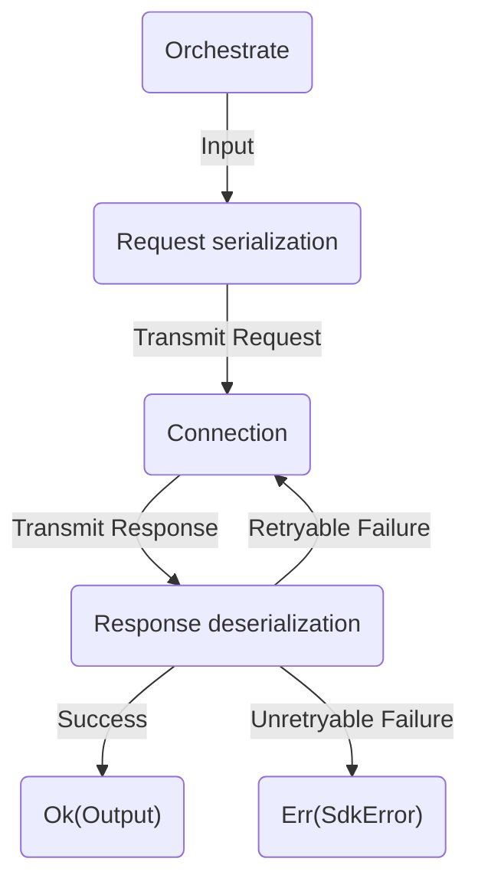

## What is the orchestrator?

At a very high level, an orchestrator is a process for transforming requests into responses. Please enjoy this fancy chart:



This process is also referred to as the "request/response lifecycle." In this example, the types of "transmit request" and "transmit response" are protocol-dependent. Typical operations use [HTTP], but we plan to support other protocols like [MQTT] in the future.

In addition to the above steps, the orchestrator must also handle:

- **Endpoint resolution:** figuring out which URL to send a request to.
- **Authentication, identity resolution, and request signing:** Figuring out who is sending the request, their credentials, and how we should insert the credentials into a request.
- **Interceptors**: Running lifecycle hooks at each point in the request/response lifecycle.
- **Runtime Plugins:** Resolving configuration from config builders.
- **Retries:** Categorizing responses from services and deciding whether to retry and how long to wait before doing so.
- **Trace Probes:** A [sink] for events that occur during the request/response lifecycle.

## How is an orchestrator configured?

While the structure of an orchestrator is fixed, the actions it takes during its lifecycle are highly configurable. Users have two ways to configure this process:

- **Runtime Plugins**:
    - **When can these be set?** Any time before calling `orchestrate`.
    - **When are they called by the orchestrator?** In two batches, at the very beginning of `orchestrate`.
    - **What can they do?**
        - They can set configuration to be used by the orchestrator or in interceptors.
        - They can set interceptors.
    - **Are they user-definable?** No. At present, only smithy-rs maintainers may define these.
- **Interceptors**:
    - **When can these be set?** Any time before calling `orchestrate`.
    - **When are they called by the orchestrator?** At each step in the request-response lifecycle.
    - **What can they do?**
        - They can set configuration to be used by the orchestrator or in interceptors.
        - They can log information.
        - Depending on when they're run, they can modify the input, transmit request, transmit response, and the output/error.
    - **Are they user-definable?** Yes.

Configuration for a request is constructed by runtime plugins just after calling `orchestrate`. Configuration is stored in a `ConfigBag`: a hash map that's keyed on type's [`TypeId`][TypeId] (an opaque object, managed by the Rust compiler, which references some type.)

## What does the orchestrator do?

The orchestrator's work is divided into four phases:

*NOTE: If an interceptor fails, then the other interceptors for that lifecycle event are still run. All resulting errors are collected and emitted together.*

0. **Building the `ConfigBag` and mounting interceptors**.
    - *This phase is fallible.*
    - An interceptor context is created. This will hold request and response objects, making them available to interceptors.
    - All runtime plugins set at the client-level are run. These plugins can set config and mount interceptors. Any _"read before execution"_ interceptors that have been set get run.
    - All runtime plugins set at the operation-level are run. These plugins can also set config and mount interceptors. Any new _"read before execution"_ interceptors that have been set get run.
1. **Request Construction**
    - *This phase is fallible.*
    - The _"read before serialization"_ and _"modify before serialization"_ interceptors are called.
    - The input is serialized into a transmit request.
    -  The _"read after serialization"_ and _"modify before retry_ loop" interceptors are called.
    - Before making an attempt, the retry handler is called to check if an attempt should be made. The retry handler makes this decision for an initial attempt as well as for the retry attempts. If an initial attempt should be made, then the orchestrator enters the Dispatch phase. Otherwise, a throttling error is returned.
2. **Request Dispatch**
    - *This phase is fallible. This phase's tasks are performed in a loop. Retryable request failures will be retried, and unretryable failures will end the loop.*
    - The _"read before attempt"_ interceptors are run.
    - An endpoint is resolved according to an endpoint resolver. The resolved endpoint is then applied to the transmit request.
    - The _"read before signing"_ and _"modify before signing"_ interceptors are run.
    - An identity and a signer are resolved according to an authentication resolver. The signer then signs the transmit request with the identity.
    - The _"read after signing"_, _"read before transmit"_, and _"modify before transmit"_ interceptors are run.
    - The transmit request is passed into the connection, and a transmit response is received.
    - The _"read after transmit"_, _"read before deserialization"_, and _"modify before deserialization"_ interceptors are run.
    - The transmit response is deserialized.
    - The _"read after attempt"_ and _"modify before attempt_ completion" interceptors are run.
    - The retry strategy is called to check if a retry is necessary. If a retry is required, the Dispatch phase restarts. Otherwise, the orchestrator enters the Response Handling phase.
3. **Response Handling**
    - *This phase is fallible.*
    - The _"read after deserialization"_ and _"modify before completion"_ interceptors are run.
    - Events are dispatched to any trace probes that the user has set.
    - The _"read after execution"_ interceptors are run.

At the end of all this, the response is returned. If an error occurred at any point, then the response will contain one or more errors, depending on what failed. Otherwise, the output will be returned.

## How is the orchestrator implemented in Rust?

### Avoiding generics at all costs

In designing the orchestrator, we sought to solve the problems we had with the original smithy client. The client made heavy use of generics, allowing for increased performance, but at the cost of increased maintenance burden and [increased compile times][monomorphization]. The Rust compiler, usually very helpful, isn't well-equipped to explain trait errors when bounds are this complex, and so the resulting client was difficult to extend. [Trait aliases] would have helped, but they're not (at the time of writing) available.

*The type signatures for the old client and its `call` method:*

```rust,ignore
impl<C, M, R> Client<C, M, R>
where
    C: bounds::SmithyConnector,
    M: bounds::SmithyMiddleware<C>,
    R: retry::NewRequestPolicy,
{
    pub async fn call<O, T, E, Retry>(&self, op: Operation<O, Retry>) -> Result<T, SdkError<E>>
        where
            O: Send + Sync,
            E: std::error::Error + Send + Sync + 'static,
            Retry: Send + Sync,
            R::Policy: bounds::SmithyRetryPolicy<O, T, E, Retry>,
            Retry: ClassifyRetry<SdkSuccess<T>, SdkError<E>>,
            bounds::Parsed<<M as bounds::SmithyMiddleware<C>>::Service, O, Retry>:
            Service<Operation<O, Retry>, Response=SdkSuccess<T>, Error=SdkError<E>> + Clone,
    {
        self.call_raw(op).await.map(|res| res.parsed)
    }

    pub async fn call_raw<O, T, E, Retry>(
        &self,
        op: Operation<O, Retry>,
    ) -> Result<SdkSuccess<T>, SdkError<E>>
        where
            O: Send + Sync,
            E: std::error::Error + Send + Sync + 'static,
            Retry: Send + Sync,
            R::Policy: bounds::SmithyRetryPolicy<O, T, E, Retry>,
            Retry: ClassifyRetry<SdkSuccess<T>, SdkError<E>>,
        // This bound is not _technically_ inferred by all the previous bounds, but in practice it
        // is because _we_ know that there is only implementation of Service for Parsed
        // (ParsedResponseService), and it will apply as long as the bounds on C, M, and R hold,
        // and will produce (as expected) Response = SdkSuccess<T>, Error = SdkError<E>. But Rust
        // doesn't know that -- there _could_ theoretically be other implementations of Service for
        // Parsed that don't return those same types. So, we must give the bound.
            bounds::Parsed<<M as bounds::SmithyMiddleware<C>>::Service, O, Retry>:
            Service<Operation<O, Retry>, Response=SdkSuccess<T>, Error=SdkError<E>> + Clone,
    {
        // The request/response lifecycle
    }
}
```

*The type signature for the new `orchestrate` method:*

```rust,ignore
pub async fn orchestrate(
    input: Input,
    runtime_plugins: &RuntimePlugins,
    // Currently, SdkError is HTTP-only. We currently use it for backwards-compatibility purposes.
    // The `HttpResponse` generic will likely be removed in the future.
) -> Result<Output, SdkError<Error, HttpResponse>> {
	// The request/response lifecycle
}
```

Wait a second, I hear you ask. "I see an `Input` and `Output` there, but you're not declaring any generic type arguments. What gives?"

I'm glad you asked. Generally, when you need traits, but you aren't willing to use generic type arguments, then you must [`Box`][std::boxed]. Polymorphism is achieved through [dynamic dispatch] instead of [static dispatch], and this comes with a small runtime cost.

So, what are `Input` and `Output`? They're our own special flavor of a boxed trait object.

```rust,ignore
pub type Input = TypeErasedBox;
pub type Output = TypeErasedBox;
pub type Error = TypeErasedBox;

/// A new-type around `Box<dyn Any + Send + Sync>`
#[derive(Debug)]
pub struct TypeErasedBox {
    inner: Box<dyn Any + Send + Sync>,
}
```

The orchestrator itself doesn't know about any concrete types. Instead, it passes boxed data between the various components of the request/response lifecycle. Individual components access data in two ways:

1. **From the `ConfigBag`:**
  - *(with an accessor)* `let retry_strategy = cfg.retry_strategy();`
  - *(with the get method)* `let retry_strategy = cfg.get::<Box<dyn RetryStrategy>>()`
2. **From the `InterceptorContext`:**
  - *(owned)* `let put_object_input: PutObjectInput = ctx.take_input().unwrap().downcast().unwrap()?;`
  - *(by reference)* `let put_object_input = ctx.input().unwrap().downcast_ref::<PutObjectInput>().unwrap();`

Users can only call `ConfigBag::get` or [downcast] a `TypeErasedBox` to types they have access to, which allows maintainers to ensure encapsulation. For example: a plugin writer may declare a private type, place it in the config bag, and then later retrieve it. Because the type is private, only code in the same crate/module can ever insert or retrieve it. Therefore, there's less worry that someone will depend on a hidden, internal detail and no worry they'll accidentally overwrite a type in the bag.

> *NOTE: When inserting values into a config bag, using one of the `set_<component>` methods is always preferred, as this prevents mistakes related to inserting similar, but incorrect types.*

### The actual code

The current implementation of `orchestrate` is defined [here][orchestrate-impl], in the [`aws-smithy-runtime` crate][aws-smithy-runtime]. Related code can be found in the [`aws-smithy-runtime-api` crate][aws-smithy-runtime].

## Frequently asked questions

### Why can't users create and use their own runtime plugins?

We chose to hide the runtime plugin API from users because we are concerned that exposing it will cause more problems than it solves. Instead, we encourage users to use interceptors. This is because, when setting a runtime plugin, any existing runtime plugin with the same type will be replaced. For example, there can only be one retry strategy or response deserializer. Errors resulting from unintentionally overriding a plugin would be difficult for users to diagnose, and would consume valuable development time.

### Why does the orchestrator exist?

The orchestrator exists because there is an AWS-internal initiative to bring the architecture of all AWS SDKs closer to one another.

### Why does this document exist when there's already an orchestrator RFC?

Because RFCs become outdated as designs evolve. It is our intention to keep this document up to date with our current implementation.

[HTTP]: https://en.wikipedia.org/wiki/HTTP
[MQTT]: https://en.wikipedia.org/wiki/MQTT
[sink]: https://en.wikipedia.org/wiki/Sink_(computing)
[trait aliases]: https://github.com/rust-lang/rust/issues/41517
[std::boxed]: https://doc.rust-lang.org/std/boxed/index.html
[monomorphization]: https://rustc-dev-guide.rust-lang.org/backend/monomorph.html#polymorphization
[static dispatch]: https://doc.rust-lang.org/book/ch10-01-syntax.html#performance-of-code-using-generics
[dynamic dispatch]: https://doc.rust-lang.org/book/ch17-02-trait-objects.html#trait-objects-perform-dynamic-dispatch
[TypeId]: https://doc.rust-lang.org/stable/std/any/struct.TypeId.html
[downcast]: https://en.wikipedia.org/wiki/Downcasting
[orchestrate-impl]: https://github.com/awslabs/smithy-rs/blob/8bc93fc04dd8c8d7447bfe3f5196a75cba0b10ba/rust-runtime/aws-smithy-runtime/src/client/orchestrator.rs#L23
[aws-smithy-runtime]: https://github.com/awslabs/smithy-rs/tree/main/rust-runtime/aws-smithy-runtime
[aws-smithy-runtime-api]: https://github.com/awslabs/smithy-rs/tree/main/rust-runtime/aws-smithy-runtime-api
