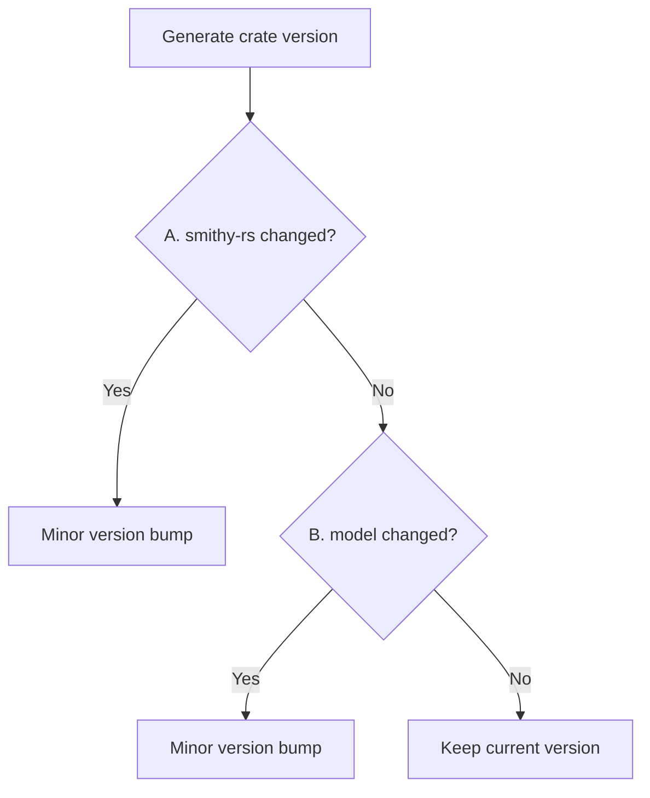
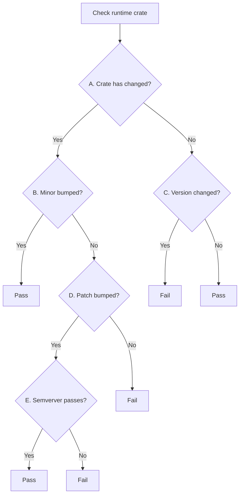

RFC: Independent Crate Versioning
=================================

> Status: RFC

During its alpha and dev preview releases, the AWS SDK for Rust adopted [a short-term solution
for versioning and publishing to crates.io](./rfc0011_crates_io_alpha_publishing.md).
This doc proposes a long-term versioning strategy that will carry the SDK from dev preview
into general availability.

This strategy will be implemented in two phases:
1. __Dev Preview__: The SDK will break with its current version strategy
   of maintaining consistent `major.minor` version numbers.
2. __Stability and 1.x__: This phase begins when the SDK becomes generally available. The
   major version will be bumped to 1, and backwards breaking changes will no longer be allowed
   without a major version bump to all crates in the SDK.

Terminology
-----------

- **AWS SDK Crate**: A crate that provides a client for calling a given AWS service, such as `aws-sdk-s3` for calling S3.
- **AWS Runtime Crate**: Any runtime crate that the AWS SDK generated code relies on, such as `aws-types`.
- **Smithy Runtime Crate**: Any runtime crate that the [smithy-rs] generated code relies on, such as `smithy-types`.

Requirements
------------

### Versioning

Cargo uses [semver] for versioning, with a `major.minor.patch-pre` format:
- `major`: Incompatible API changes
- `minor`: Added functionality in backwards compatible manner
- `patch`: Backwards compatible bug fixes
- `pre`: Pre-release version tag (omitted for normal releases)

In the new versioning strategy, the `minor` version number will no longer be coordinated across
all SDK and Smithy runtime crates.

During phases 1 and 2, the `major` version will always be 0, and the following scheme will be used:
- `minor`:
  - New features
  - Breaking changes
  - Dependency updates for dependencies that are part of the public API
  - Model updates with API changes
  - For code-generated crates: when a newer version of [smithy-rs] is used to generate the crate
- `patch`:
  - Bug fixes that do not break backwards compatibility
  - Model updates that _only_ have documentation changes

During phase 3:
- `major`: Breaking changes
- `minor`:
    - Changes that aren't breaking
    - Dependency updates for dependencies that are part of the public API
    - Model updates with API changes
    - For code-generated crates: when a newer version of [smithy-rs] is used to generate the crate
- `patch`:
    - Bug fixes that do not break backwards compatibility
    - Model updates that _only_ have documentation changes

During phase 3, bumps to the `major` version must be coordinated across all SDK and runtime crates.

### Release Identification

Since there will no longer be one SDK "version", release tags will be dates in `YYYY-MM-DD` format
rather than version numbers. Additionally, the SDK's user agent string will need to include a separate
service version number (this requirement has already been implemented).

### Yanking

It must be possible to yank an entire release with a single action. The publisher tool must
be updated to understand which crate versions were released with a given release tag, and be able to
yank all the crates published from that tag.

Phase 1: Dev Preview
--------------------

Phase 1 will address the following challenges introduced by uncoordinating the `major.minor` versions:
- Tracking of versions associated with a release tag
- Creation of version bump process for code generated crates
- Enforcement of version bump process in runtime crates
- Yanking of versions associated with a release tag

### Version Tracking

A new manifest file will be introduced in the root of [aws-sdk-rust] named `versions.toml` that describes
all versioning information for any given commit in the repository. In the main branch, the `versions.toml`
in tagged commits will become the source of truth for which crate versions belong to that release, as well
as additional metadata that's required for maintaining version process in the future.

The special `0.0.0-smithy-rs-head` version that is used prior to Phase 1 for maintaining the runtime crate
versions will no longer be used (as detailed in [Versioning for Runtime Crates](#versioning-for-runtime-crates)).

This format will look as follows:
```toml
smithy_rs_version = "<release-tag|commit-hash>"

[aws-smithy-types]
version = "0.50.1"

[aws-config]
version = "0.40.0"

[aws-sdk-s3]
version = "0.89.0"
model_hash = "<hash>"

# ...
```

The auto-sync tool is responsible for maintaining this file. When it generates a new SDK, it will take
the version numbers from runtime crates directly, and it will use the rules from the next section to determine
the version numbers for the generated crates.

### Versioning for Code Generated (SDK Service) Crates

Code generated crates will have their `minor` version bumped when the version of [smithy-rs] used to generate
them changes, or when model updates with API changes are made. Three pieces of information are required to
handle this process: the previously released version number, the [smithy-rs] version used to generate the code,
and the level of model updates being applied. For this last one, if there are multiple model updates that
affect only documentation, but then one model update that affects an API, then as a whole they will be
considered as affecting an API and require a `minor` version bump.

The previously released version number will be retrieved from crates.io using its API. The [smithy-rs] version
used during code generation will become a build artifact that is saved to `versions.toml` in [aws-sdk-rust].
During phase 1, the tooling required to know if a model is a documentation-only change will not be available,
so all model changes will result in a `minor` version bump during this phase.

Overall, determining a generated crate's version number looks as follows:



- __A: smithy-rs changed?__: Compare the `smithy_rs_version` in the previous `versions.toml` with the
  next `versions.toml` file, and if the values are different, consider [smithy-rs] to have changed.
- __B: model changed?__: Similarly, compare the `model_hash` for the crate in `versions.toml`.

### Versioning for Runtime Crates

The old scheme of all runtime crates in [smithy-rs] having a fake `0.0.0-smithy-rs-head` version number with
a build step to replace those with a consistent `major.minor` will be removed. These runtime crates will begin
having their actual next version number in the Cargo.toml file in smithy-rs.

This introduces a new problem where a developer can forget to bump a runtime crate version, so a method of
process enforcement needs to be introduced. This will be done through CI when merging into `smithy-rs/main`
and repeated when merging into `aws-sdk-rust/main`.

The following checks need to be run for runtime crates:


- __A: Crate has changed?__ The crate's source files and manifest will be hashed for the previous version
  and the next version. If these hashes match, then the crate is considered unchanged.
- __B: Minor bumped?__ The previous version is compared against the next version to see if the minor version
  number was bumped.
- __C: Version changed?__ The previous version is compared against the next version to see if it changed.
- __D: Patch bumped?__ The previous version is compared against the next version to see if the patch version
  number was bumped.
- __E: Semverver passes?__ Runs [rust-semverver] against the old and new versions of the crate.
  - If semverver fails to run (for example, if it needs to be updated to the latest nightly to succeed),
    then fail CI saying that either semverver needs maintenance, or that a minor version bump is required.
  - If semverver results in errors, fail CI indicating a minor version bump is required.
  - If semverver passes, then pass CI.

When running semverver, the path dependencies of the crate under examination should be updated to be crates.io
references if there were no changes in those crates since the last public to crates.io. Otherwise, the types
referenced from those crates in the public API will always result in breaking changes since, as far as the Rust
compiler is concerned, they are different types originating from separate path-dependency crates.

For CI, the `aws-sdk-rust/main` branch's `versions.toml` file is the source of truth for the previous release's
crate versions and source code.

### Yanking

The publisher tool will be updated to read the `versions.toml` to yank all versions published in a release.
This process will look as follows:
1. Take a path to a local clone of the [aws-sdk-rust] repository
2. Confirm the working tree is currently unmodified and on a release tag.
3. Read `versions.toml` and print out summary of crates to yank
4. Confirm with user before proceeding
5. Yank crates

### Changes Checklist

- [ ] Update `rust-semverver` to a newer nightly that can compile `aws-smithy-client`
- [ ] Establish initial `versions.toml` in `aws-sdk-rust/main`
- [ ] Set version numbers in runtime crates in [smithy-rs]
- [ ] Update the auto-sync tool to generate `versions.toml`
- [ ] Create CI tool to check runtime crate version
  - [ ] Integrate with `smithy-rs/main` CI
  - [ ] Integrate with `aws-sdk-rust/main` CI
- [ ] Update CI to verify no older runtime crates are used. For example, if `aws-smithy-client` is bumped to
      `0.50.0`, then verify no crates (generated or runtime) depend on `0.49.0` or lower.

**Estimate:** 2-4 dev weeks

Phase 2: Stability and 1.x
--------------------------

When stabilizing to 1.x, the version process will stay the same, but the minor version bumps caused by version
bumping runtime crates, updating models, or changing the code generator will be candidate for automatic upgrade
per semver. At that point, no further API breaking changes can be made without a major version bump.

[aws-sdk-rust]: https://github.com/awslabs/aws-sdk-rust
[rust-semverver]: https://github.com/rust-lang/rust-semverver
[semver]: https://semver.org/
[smithy-rs]: https://github.com/awslabs/smithy-rs
