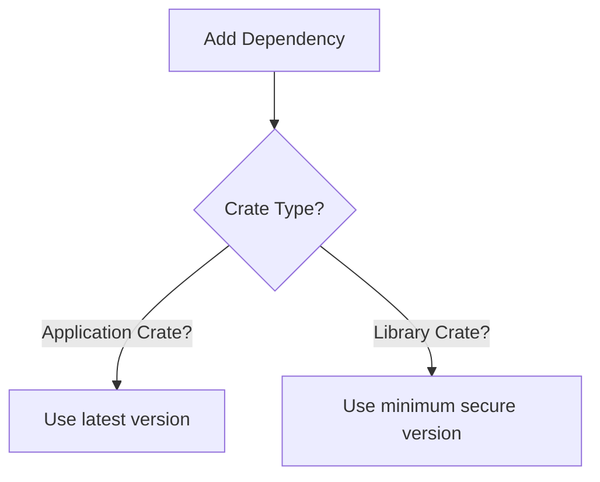

RFC: Dependency Versions
========================

> Status: Accepted
>
> Applies to: Client and Server

This RFC outlines how Rust dependency versions are selected for the smithy-rs project, and
strives to meet the following semi-conflicting goals:

- Dependencies are secure
- Vended libraries have dependency ranges that overlap other Rust libraries as much as possible

When in conflict, the security goal takes priority over the compatibility goal.

Categorization of Crates
------------------------

The Rust crates within smithy-rs can be divided up into two categories:

1. **Library Crates:** Crates that are published to crates.io with the intention that other projects
   will depend on them via their `Cargo.toml` files. This category does NOT include binaries that
   are published to crates.io with the intention of being installed with `cargo install`.
2. **Application Crates:** All examples, binaries, tools, standalone tests, or other crates that are
   not published to crates.io with the intent of being depended on by other projects.

All generated crates must be considered library crates even if they're not published since they are intended
to be pulled into other Rust projects with other dependencies.

### Support crates for Applications

The `aws-smithy-http-server-python` crate doesn't fit the categorization rules well since
it is a runtime crate for a generated Rust application with bindings to Python. This RFC
establishes this crate as an application crate since it needs to pull in application-specific
dependencies such as `tracing-subscriber` in order to implement its full feature set.

Dependency Version Rules
------------------------

Application crates _should_ use the latest versions of dependencies, but _must_ use a version greater than or equal
to the minimum secure version as determined by the [RUSTSEC advisories database]. Library crates _must_ use the
minimum secure version. This is illustrated at a high level below:

### What is a minimum secure version when there are multiple major versions?

If a dependency has multiple supported major versions, then the latest major version must be selected unless
there is a compelling reason to do otherwise (such as the previous major version having been previously
exposed in our public API). Choosing newer major versions will reduce the amount of upgrade work that
needs to be done at a later date when support for the older version is inevitably dropped.

Changes Checklist
-----------------

Some work needs to be done to establish these guidelines:
- [ ] Establish automation for enforcing minimum secure versions for the direct dependencies of library crates

<!-- # Links -->

[RUSTSEC advisories database]: https://rustsec.org/advisories/
