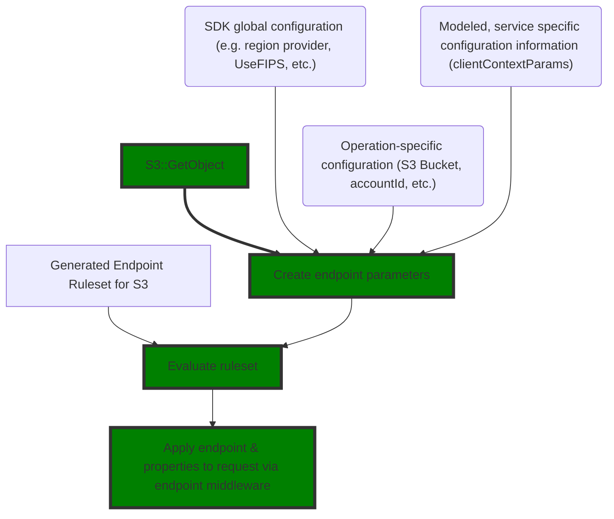

<!-- Give your RFC a descriptive name saying what it would accomplish or what feature it defines -->
RFC: Endpoints 2.0
=============

<!-- RFCs start with the "RFC" status and are then either "Implemented" or "Rejected".  -->
> Status: RFC

<!-- A great RFC will include a list of changes at the bottom so that the implementor can be sure they haven't missed anything -->
For a summarized list of proposed changes, see the [Changes Checklist](#changes-checklist) section.

<!-- Insert a short paragraph explaining, at a high level, what this RFC is for -->
This RFC defines how the Rust SDK will integrate with the next generation of endpoint resolution logic (Endpoints 2.0).
Endpoints 2.0 defines a rules language for resolving endpoints. The Rust SDK will code-generate Rust code from this
intermediate language and use this to create service-specific endpoint resolvers.

Endpoints 2.0 will be a native Smithy feature and be available for vanilla SDKs as well as the AWS SDK.

<!-- The "Terminology" section is optional but is really useful for defining the technical terms you're using in the RFC -->
Terminology
-----------

- **Smithy-native**: In reference to features/code that is _not_ AWS specific and is supported for all Smithy clients.
- **Rules language**: A JSON-based rules language used to resolve endpoints
- [**Smithy Endpoint**](#the-endpoint-struct): An endpoint, as returned from the rules-language. This contains a URI,
  headers, and configuration map of `String -> Document`. This must
  undergo [another level of transformation](#converting-a-smithy-endpoint-to-an-aws-endpoint) before it
  can be used as an `AwsEndpoint`.
- **AWS Endpoint**: An endpoint with explicit signing configuration applied. AWS Endpoints need to contain region &
  service metadata to control signing.
- **Middleware**: A transformation applied to a request, prior to request dispatch
- **Endpoint Parameters**: A code-generated structure for each service which contains service-specific (and general)
  endpoint parameters.

<!-- Explain how users will use this new feature and, if necessary, how this compares to the current user experience -->
The user experience if this RFC is implemented
----------------------------------------------

### Overview

SDKs will generate a new, public, `endpoint` module. The module will contain a [`Params`](#endpoint-params) structure
and
a [`DefaultResolver`](#the-default-endpoint-resolver). Supporting these modules, a private `endpoints_impl` module will
be generated.
> **Why generate two modules**?
>
> Generating two separate modules, `endpoint` and `endpoint_impl` ensures that we don't have namespace collisions
> between hand-written and generated
> code.

SDK middleware will be updated to use the new [`smithy_types::Endpoint`](#the-endpoint-struct). During request
construction in `make_operation`, a [Smithy endpoint](#the-endpoint-struct) will be inserted into the property bag. The
endpoint middleware will be updated to extract the Smithy endpoint from the property bag and set the request endpoint &
signing information accordingly (see: [Converting to AWS Endpoint](#converting-a-smithy-endpoint-to-an-aws-endpoint)).

The following flow chart traces the endpoints 2.0 influence on a request via the green boxes.



### Overriding Endpoints

In the general case, users will not be impacted by Endpoints 2.0 with one exception: today, users can provide a
global endpoint provider that can override different services. There is a single `ResolveAwsEndpoint` trait that
is shared across all services. However, this isn't the case for `Endpoints 2.0` where the trait actually has a generic
parameter:

```rust
pub trait ResolveAwsEndpoint<T>: Send + Sync {
    fn resolve_endpoint(&self, params: &T) -> Result<AwsEndpoint, BoxError>;
}
```

The trait itself would then be parameterized by service-specific endpoint parameter, eg:
`aws_sdk_s3::endpoint::Params`. The endpoint parameters we would use for S3 (e.g. including `Bucket`) are different
from the endpoint parameters we might use for a service like DynamoDB which, today, doesn't have any custom endpoint
behavior.

Going forward we want to provide two different avenues for customers to customize endpoints:

1. Configuration driven URL override. This mechanism hasn't been specified, but suppose that the Rust SDK supported
   an `SDK_ENDPOINT` environment variable. This variable would be an input to the existing endpoint resolver.
   machinery and would be backwards compatible with other SDKs (e.g. by prefixing the bucket as a host label for S3).
2. Wholesale endpoint resolver override. In this case, customers would gain access to all endpoint parameters and be
   able to write their own resolver.

This RFC proposes making the following changes:

1. For the current _global_ ability to override an endpoint, instead of accepting an `AwsEndpoint`, accept a URI. This
   will simplify the interface for most customers who don't actually need logic-driven endpoint construction. The
   Endpoint that can be set will be passed in as the `SDK::Endpoint` built-in. This will be renamed to `endpoint_uri`
   for clarity. **All** AWS services **MUST** accept the `SDK::Endpoint` built-in.
2. For complex, service-specific behavior, customers will be able to provide a service specific endpoint resolver at
   client construction time. This resolver will be parameterized with the service-specific parameters type,
   (e.g. `aws_sdk_s3::endpoint::Params`). Finally, customers will be able to access the `default_resolver()` for S3
   directly. This will enable them to utilize the default S3 endpoint resolver in their resolver implementation.

**Example: overriding the endpoint URI globally**

```rust
async fn main() {
    let sdk_conf = aws_config::from_env().endpoint_uri("http://localhost:8123".parse().unwrap()).load().await;
    let dynamo = aws_sdk_dynamodb::Client::new(&sdk_conf);
    // snip ...
}
```

**Example: overriding the endpoint resolver for a service**

```rust
/// Resolve to Localhost when an environment variable is set
struct CustomDdbResolver;

impl ResolveEndpoint<aws_sdk_dynamodb::endpoint::Params> for CustomDdbResolver {
    fn resolve_endpoint(&self, params: &Params) -> Result<Endpoint, EndpointResolutionError> {
        // custom resolver to redirect to DDB local if a flag is set
        let base_endpoint = aws_sdk_dynamodb::endpoint::default_resolver().resolve_endpoint(params).expect("valid endpoint should be resolved");
        if env::var("LOCAL") == Ok("true") {
            // update the URI on the returned endpoint to localhost while preserving the other properties
            base_endpoint.builder().uri("http://localhost:8888").build()
        } else {
            base_endpoint
        }
    }
}

async fn main() {
    let conf = aws_config::load_from_env().await;
    let ddb_conf = aws_sdk_dynamodb::config::Builder::from(&conf).endpoint_resolver(CustomDdbResolver);
    let dynamodb = aws_sdk_dynamodb::Client::from_conf(ddb_conf);
}
```

> **What about alternative S3 implementations? How do we say "don't put prefix bucket on this?"**
>
> For cases where users want to use the provided URL directly with no modification users will need to rely on service
> specific configuration, like forcing path style addressing for S3.

_Alternative Design_: [Context Aware Endpoint Trait](#context-aware-endpoint-traits)

> _Optional addition_: We could add an additional `EndpointResolver` parameter to `SdkConfig` that exposed a global
> trait
> where `Params` is `&dyn Any` similar to [Context Aware Endpoint Trait](#context-aware-endpoint-traits). If these were
**both** set, a runtime panic would alert users to the misconfiguration.

### New Endpoint Traits

The new endpoint resolution trait and `Endpoint` struct will be Smithy-native. AWS endpoint middleware will pull
the `Endpoint`
out of the property bag and read the properties to determine auth/signing + any other AWS metadata that may be required.

An example of the `Endpoint` struct is below. This struct will be in `aws-smithy-types`, however, it should initially be
gated with documentation warning about stability.

#### The Endpoint Struct

```rust
// module: `aws_smithy_types::endpoint`
// potential optimization to reduce / remove allocations for keys which are almost always static
// this can also just be `String`
type MaybeStatic<T> = Cow<'static, T>;

/// Endpoint
#[derive(Debug, PartialEq)]
pub struct Endpoint {
    // Note that this allows `Endpoint` to contain an invalid URI. During conversion to an actual endpoint, the
    // the middleware can fail, returning a `ConstructionFailure` to the user
    url: MaybeStatic<str>,
    headers: HashMap<MaybeStatic<str>, Vec<MaybeStatic<str>>>,
    properties: HashMap<MaybeStatic<str>, aws_smithy_types::Document>,
}

// not shown:
// - impl block with standard accessors
// - builder, designed to be invoked / used by generated code
```

> **What's an Endpoint property?**
>
> Endpoint properties, on their own, have no intrinsic meaning. Endpoint properties have established conventions for AWS
> SDKs. Other Smithy implementors may choose a different pattern. For AWS SDKs, the `authSchemes` key is an ordered list
> of authentication/signing schemes supported by the Endpoint that the SDK should use.

To perform produce an `Endpoint` struct we have a generic `ResolveEndpoint` trait which will be native to Smithy:

```rust
// module: `smithy_types::endpoint` or `aws_smithy_client`??
pub trait ResolveEndpoint<Params>: Send + Sync {
    /// Resolves an `Endpoint` for `Params`
    fn resolve_endpoint(&self, params: &Params) -> Result<aws_smithy_types::Endpoint, EndpointResolutionError>;
}
```

All Smithy services that have the `@endpointRules` trait applied to the service shape will code generate a default
endpoint resolver implementation. The default endpoint resolver **MUST** be public, so that customers can delegate to it
if they wish to override the endpoint resolver.

### Endpoint Params

We've mentioned "service specific endpoint parameters" a few times. In Endpoints 2.0, we will code generate Endpoint
Parameters for every service based on their rules. **Note**: the endpoint parameters themselves are generated solely
from the ruleset. The Smithy model provides additional information about parameter binding, but that only influences how
the parameters are set, *not* how they are generated.

**Example `Params` struct for S3:**

```rust
#[non_exhaustive]
#[derive(std::clone::Clone, std::cmp::PartialEq, std::fmt::Debug)]
/// Configuration parameters for resolving the correct endpoint
pub struct Params {
pub(crate) accelerate: bool,
pub(crate) bucket: std::option::Option<std::string::String>,
pub(crate) disable_access_points: std::option::Option<bool>,
pub(crate) disable_mrap: std::option::Option<bool>,
pub(crate) endpoint: std::option::Option<std::string::String>,
pub(crate) force_path_style: std::option::Option<bool>,
pub(crate) region: std::option::Option<std::string::String>,
pub(crate) use_dual_stack: bool,
pub(crate) use_fips: bool,
}

impl Params {
    /// Create a builder for [`Params`]
    pub fn builder() -> crate::endpoint_resolver::Builder {
        crate::endpoint_resolver::Builder::default()
    }
    /// Gets the value for bucket
    pub fn bucket(&self) -> std::option::Option<&str> {
        self.bucket.as_deref()
    }
    /// Gets the value for region
    pub fn region(&self) -> std::option::Option<&str> {
        self.region.as_deref()
    }
    /// Gets the value for use_fips
    pub fn use_fips(&self) -> std::option::Option<bool> {
        Some(self.use_fips)
    }
    /// Gets the value for use_dual_stack
    pub fn use_dual_stack(&self) -> std::option::Option<bool> {
        Some(self.use_dual_stack)
    }
    // ... more accessors
}
```

### The default endpoint resolver

When an endpoint ruleset is present, Smithy will code generate an endpoint resolver from that ruleset. The endpoint
resolver
**MUST** be a struct so that it can store/cache computations (such as a partition resolver that has compiled regexes).

```rust
pub struct DefaultEndpointResolver {
    partition_resolver: PartitionResolver
}

impl ResolveEndpoint<crate::endpoint::Params> for DefaultEndpointResolver {
    fn resolve_endpoint(&self, params: &Params) -> Result<aws_smithy_types::Endpoint, EndpointResolutionError> {
        // delegate to private impl
        crate::endpoints_impl::resolve_endpoint(params)
    }
}
```

`DefaultEndpointResolver` **MUST** be publicly accessible and offer both a default constructor and the ability to
configure resolution behavior (e.g. by supporting adding additional partitions.)


How to actually implement this RFC
----------------------------------
To describe how this feature will work, let's take a step-by-step path through endpoint resolution.

1. A user defines a service client, possibly with some client specific configuration like region.

   > `@clientContextParams` are code generated onto the client `Config`.
     [Code generating `@clientContextParams`](#code-generating-client-context-params)

2. A user invokes an operation like `s3::GetObject`. A [params object is created](#creating-params). In the body
   of `make_operation()`, this is passed to `config.endpoint_resolver` to load a Smithy-native endpoint. The Smithy
   native endpoint is written into the property bag.
3. The AWS endpoint middleware (non-generic) reads the endpoint out of the property bag and uses it to create an AWS
   endpoint. See [converting to AWS Endpoint](#converting-a-smithy-endpoint-to-an-aws-endpoint).
4. The request is dispatched!

The other major piece of implementation required is actually implementing the rules engine. To learn more about
rules-engine internals, skip to [implementing the rules engine](#implementing-the-rules-engine).

### Code generating client context params

When a smithy model uses the `@clientContextParams` trait, we need to generate client params onto the Rust SDK. This is
a **Smithy-native** feature. This should be implemented as a "standard" config decorator that reads traits from the
current model.

<details>
<summary>Kotlin Snippet for Client context params</summary>

```kotlin
class ClientContextDecorator(ctx: ClientCodegenContext) : NamedSectionGenerator<ServiceConfig>() {
    private val contextParams = ctx.serviceShape.getTrait<ClientContextParamsTrait>()?.parameters.orEmpty().toList()
        .map { (key, value) -> ContextParam.fromClientParam(key, value, ctx.symbolProvider) }

    data class ContextParam(val name: String, val type: Symbol, val docs: String?) {
        companion object {
            private fun toSymbol(shapeType: ShapeType, symbolProvider: RustSymbolProvider): Symbol =
                symbolProvider.toSymbol(
                    when (shapeType) {
                        ShapeType.STRING -> StringShape.builder().id("smithy.api#String").build()
                        ShapeType.BOOLEAN -> BooleanShape.builder().id("smithy.api#Boolean").build()
                        else -> TODO("unsupported type")
                    }
                )

            fun fromClientParam(
                name: String,
                definition: ClientContextParamDefinition,
                symbolProvider: RustSymbolProvider
            ): ContextParam {
                return ContextParam(
                    RustReservedWords.escapeIfNeeded(name.toSnakeCase()),
                    toSymbol(definition.type, symbolProvider),
                    definition.documentation.orNull()
                )
            }
        }
    }

    override fun section(section: ServiceConfig): Writable {
        return when (section) {
            is ServiceConfig.ConfigStruct -> writable {
                contextParams.forEach { param ->
                    rust("pub (crate) ${param.name}: #T,", param.type.makeOptional())
                }
            }
            ServiceConfig.ConfigImpl -> emptySection
            ServiceConfig.BuilderStruct -> writable {
                contextParams.forEach { param ->
                    rust("${param.name}: #T,", param.type.makeOptional())
                }
            }
            ServiceConfig.BuilderImpl -> writable {
                contextParams.forEach { param ->
                    param.docs?.also { docs(it) }
                    rust(
                        """
                        pub fn ${param.name}(mut self, ${param.name}: #T) -> Self {
                            self.${param.name} = Some(${param.name});
                            self
                        }
                        """,
                        param.type
                    )
                }
            }
            ServiceConfig.BuilderBuild -> writable {
                contextParams.forEach { param ->
                    rust("${param.name}: self.${param.name},")
                }
            }
            else -> emptySection
        }
    }
}
```

</details>

### Creating `Params`

`Params` will be created and utilized in smithy-native code generation.

`make_operation()` needs to load the parameters from several configuration sources. These sources have a priority order.
To handle this priority order, we will load from all sources in reverse priority order, with lower priority sources
overriding higher priority ones.

<details>
<summary>Implementation of operation decorator</summary>

```kotlin
class EndpointParamsDecorator(
    private val ctx: ClientCodegenContext,
    private val operationShape: OperationShape,
) : OperationCustomization() {
    val idx = ContextIndex.of(ctx.model)
    private val ruleset = EndpointRuleset.fromNode(ctx.serviceShape.expectTrait<EndpointRuleSetTrait>().ruleSet)

    override fun section(section: OperationSection): Writable {
        return when (section) {
            is OperationSection.MutateInput -> writable {
                rustTemplate(
                    """
                    let params = #{Params}::builder()
                        #{builder:W}.expect("invalid endpoint");
                    """,
                    "Params" to EndpointParamsGenerator(ruleset).paramsStruct(),
                    "builder" to builderFields(section)
                )
            }
            is OperationSection.MutateRequest -> writable {
                rust("// ${section.request}.properties_mut().insert(params);")
            }
            else -> emptySection
        }
    }

    private fun builderFields(section: OperationSection.MutateInput) = writable {
        val memberParams = idx.getContextParams(operationShape)
        val builtInParams = ruleset.parameters.toList().filter { it.isBuiltIn }
        // first load builtins and their defaults
        builtInParams.forEach { param ->
            val defaultProviders = section.endpointCustomizations.mapNotNull { it.defaultFor(param, section.config) }
            if (defaultProviders.size > 1) {
                error("Multiple providers provided a value for the builtin $param")
            }
            defaultProviders.firstOrNull()?.also { defaultValue ->
                rust(".set_${param.name.rustName()}(#W)", defaultValue)
            }
        }
        // these can be overridden with client context params
        idx.getClientContextParams(ctx.serviceShape).forEach { (name, _param) ->
            rust(".set_${name.toSnakeCase()}(${section.config}.${name.toSnakeCase()}.as_ref())")
        }

        // lastly, allow these to be overridden by members
        memberParams.forEach { (memberShape, param) ->
            rust(".set_${param.name.toSnakeCase()}(${section.input}.${ctx.symbolProvider.toMemberName(memberShape)}.as_ref())")
        }
        rust(".build()")
    }
}
```

</details>

#### Loading values for builtIns

The fundamental point of builtIn values is enabling _other_ code generators to define where these values come from.
Because of that, we will need to expose the ability to customize builtIns. One way to do this is with a new
customization type, `EndpointCustomization`:

```kotlin
fun endpointCustomizations(
    clientCodegenContext: C,
    operation: OperationShape,
    baseCustomizations: List<EndpointCustomization>
): List<EndpointCustomization> = baseCustomizations


abstract class EndpointCustomization {
    abstract fun defaultFor(parameter: Parameter, config: String): Writable?
}
```

Customizations have the ability to specify the default value for a parameter. (Of course, these customizations need to
be wired in properly.)

### Converting a Smithy Endpoint to an AWS Endpoint

A Smithy endpoint has an untyped, string->`Document` collection of properties. We need to interpret these properties to
handle actually resolving an endpoint. We will implement this by implementing `TryFrom` from the Smithy endpoint to the
AWS endpoint:
> Note: It's possible `AWSEndpoint` will be removed entirely and the concept will be solely expressed in middleware. If
> this is the case, this code would be ported into middleware directly.

<details>
<summary>Converting from smithy-native `Endpoint` to `AwsEndpoint`</summary>

```rust
impl TryFrom<Endpoint> for AwsEndpoint {
    type Error = Box<dyn std::error::Error + Send + Sync>;

    fn try_from(value: Endpoint) -> Result<Self, Self::Error> {
        let uri: Uri = value.url().parse()?;
        let base_endpoint = SmithyEndpoint::mutable(uri);
        // look for v4 as an auth scheme
        let auth_schemes = match value
            .properties()
            .get("authSchemes")
            .ok_or("no auth schemes in metadata")?
        {
            Document::Array(schemes) => schemes,
            _other => return Err("expected an array for authSchemes".into()),
        };
        let v4 = auth_schemes
            .iter()
            .flat_map(|doc| match doc {
                Document::Object(map)
                if map.get("name") == Some(&Document::String("v4".to_string())) =>
                    {
                        Some(map)
                    }
                _ => None,
            })
            .next()
            .ok_or("could not find v4 as an acceptable auth scheme")?;

        let signing_scope = match v4
            .get("signingScope")
            .ok_or_else(|| format!("signing scope missing: {:?}", v4))?
        {
            Document::String(s) => s.clone(),
            _ => return Err("expected error".into()),
        };
        let signing_service = match v4.get("signingName").ok_or("signing service missing")? {
            Document::String(s) => s.clone(),
            _ => return Err("expected error".into()),
        };
        let credential_scope = CredentialScope::builder()
            .region(Region::new(signing_scope))
            .service(signing_service)
            .build();
        Ok(AwsEndpoint::new(base_endpoint, credential_scope))
    }
}
```

</details>

### Implementing the rules engine

<!-- Include a checklist of all the things that need to happen for this RFC's implementation to be considered complete -->
Changes checklist
-----------------
**Rules Engine**

- [ ] Endpoint rules code generator
- [ ] Endpoint params code generator
- [ ] Endpoint tests code generator
- [ ] Implement ruleset standard library functions as inlineables. Note: pending future refactoring work, the `aws.`
  functions will need to be integrated into the smithy core endpoint resolver.
- [ ] Implement partition function & ability to customize partitions
  **SDK Integration**
- [ ] Add a Smithy endpoint resolver to the service config, with a default that loads the default endpoint resolver.
- [ ] Update `SdkConfig` to accept a URI instead of an implementation of `ResolveAwsEndpoint`. This change can be done
  standalone.
- [ ] Remove/deprecate the `ResolveAwsEndpoint` trait and replace it with the vanilla Smithy trait. Potentially, provide
  a bridge.
- [ ] Update `make_operation` to write a [`smithy::Endpoint`](#the-endpoint-struct) into the property bag
- [ ] Update AWS Endpoint middleware to work off of a [`smithy::Endpoint`](#the-endpoint-struct)
- [ ] Wire the endpoint override to the `SDK::Endpoint` builtIn parameter

Alternative Designs
-------------------

### Context Aware Endpoint Traits

An alternative design that could provide more flexibility is a context-aware endpoint trait where the return type would
give context about the endpoint being returned. This would, for example, allow a customer to say explicitly "don't
modify this endpoint":

```rust
enum ContextualEndpoint {
    /// Just the URI please. Pass it into the default endpoint resolver as a baseline
    Uri { uri: Uri, immutable: bool },

    /// A fully resolved, ready to rumble endpoint. Don't bother hitting the default endpoint resolver, just use what
    /// I've got.
    AwsEndpoint(AwsEndpoint)
}

trait ResolveGlobalEndpoint {
    fn resolve_endpoint(params: &dyn Any) -> Result<ContextualEndpoint, EndpointResolutionError>;
}
```

Service clients would then use `ResolveGlobalEndpoint`, optional specified from `SdkConfig` to perform routing
decisions.
