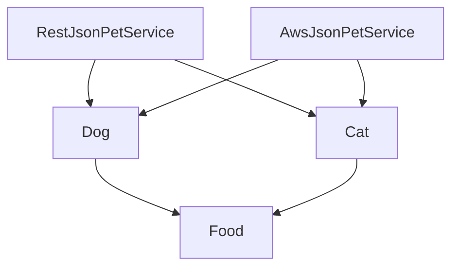
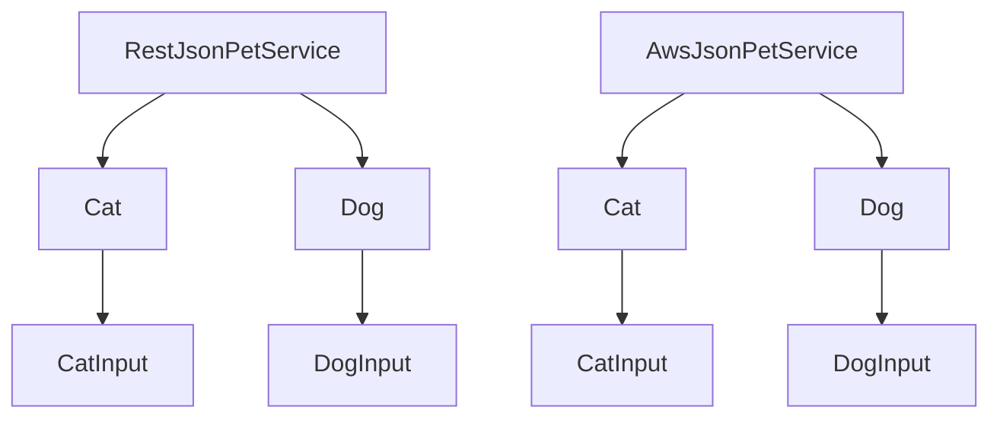

# RFC: Principles for Generating Reusable Code

> Status: Accepted

One might characterize `smithy-rs` as a way of converting [Smithy shapes](https://smithy.io/2.0/spec/model.html#shapes) into Rust types. The generated Rust types are the customer facing interface and, for this reason, they should accurately and predictably reflect the properties of the shapes they represent. One property that Smithy shapes enjoy is reusability. This RFC proposes simple guiding principles to ensure that reusability of Rust types reflects the reusability of Smithy shapes.

This RFC is does _not_ propose specific changes to the code generators API or the client or server Rust API. However the principles, when applied, are intended to enable desirable APIs for both the code generator and the client and server SDK.

## Terminology

- **Compatible types**: Two types are said to be "compatible", if they could in principle be collapsed into a single type. That is, if they have the identical type definition and non-conflicting methods/trait implementations.
- **Abstract Syntax Tree (AST)**: A tree representing the _syntactic_ structure of the source code of a formal language.
- **Abstract Semantic Graph (ASG)**: A graph representing the _semantic_ structure of the source code of a formal language. In our context, one can think of an ASG as an AST with additional edges introduced between nodes by the presence of identifiers. For example, a [Smithy Shape](https://smithy.io/2.0/spec/model.html#shapes), represented by a node in the ASG, would enjoy edges to each of its member shapes.
- **Valid Model**: A [Smithy model](https://smithy.io/2.0/spec/model.html) which satisfies the [Smithy specification](https://smithy.io/2.0/spec/index.html).

## Background

A basic property of Smithy is that shapes can be reused in a variety of contexts, which reduces duplication.

We use the following model throughout the RFC:

```smithy
structure Food {
    @httpLabel
    type: String
}

@http(method: "GET", uri: "/dog/{type}")
operation Dog {
    input: Food
}

@http(method: "GET", uri: "/cat/{type}")
operation Cat {
    input: Food
}

@restJson1
service RestJsonPetService {
    operations: [
        Dog,
        Cat
    ]
}

@awsJson1_0
service AwsJsonPetService {
    operations: [
        Dog,
        Cat
    ]
}
```

At high-level, the [Smithy library](https://github.com/awslabs/smithy-rs) library provides not only a way to parse the AST defined by the [Smithy IDL](https://smithy.io/2.0/spec/idl.html), but also exposes the conversion of the AST into an ASG which exposed through the [Walker](https://smithy.io/2.0/guides/building-codegen/mapping-shapes-to-languages.html#computing-a-service-closure) API.

We visually represent the ASG of this model as:



Currently, the ASG of the _generated_ Rust code looks like this:



Importantly, the `Food` structure gets transformed into a four incompatible types depending the context in which it is used. An obvious incompatibility is that `RestJsonPetService > Dog > Food` is transformed to `DogInput` while `RestJsonPetService > Cat > Food` is transformed to `CatInput`. The differences go deeper, these `DogInput` and `CatInput` have incompatible `FromRequest` implementations:

```rust
trait FromRequest<P> {
    async fn from_request(request: http::Request) -> Self;
}

impl FromRequest<RestJson1> for DogInput {
    async fn from_request(request: http::Request) -> Self {
        /* Deserialize using from the "/dog/{type}" URI */
    }
}

impl FromRequest<RestJson1> for CatInput {
    async fn from_request(request: http::Request) -> Self {
        /* Deserialize using from the "/cat/{type}" URI */
    }
}
```

If we removed the name aliasing, and named the Rust type `Food` in both cases, we'd then encounter a conflicting implementation.

In contrast, the `FromRequest` implementations generated from `RestJsonPetService > Dog > Food` and `AwsJsonPetService > Dog > Food` are compatible:

```rust
impl FromRequest<RestJson1> for DogInput {
    async fn from_request(request: http::Request) -> Self {
        /* Deserialize using from the "/dog/{type}" URI */
    }
}

impl FromRequest<AwsJson1_0> for DogInput {
    async fn from_request(request: http::Request) -> Self {
        /* Deserialize ignoring the URI entirely */
    }
}
```

This is because `FromRequest` is parameterized by the protocol and therefore a `FromRequest<RestJson1>` can co-exist with a `FromRequest<AwsJson1_0>`.

<!-- Interesting aside: If you have a recursive structure which includes an input then the code generator maps a single shape to two distinct types within one service closure. -->

Why are the generated types for `RestJsonPetService > Dog > Food` and `RestJsonPetService > Cat > Food` incompatible? How should be classify such failures?

### Directed Closures

A (directed) closure, `closure(S)`, of a given shape `S` is all shapes visitable by downwards directed traversal. In our example model `closure(Food)` only contains `Food`, whereas `closure(RestJsonPetService)` contains everything except for `AwsJsonPetService`.

The typical customer interacts with code generator by providing a service shape, via `smithy-build-template.json`, which returns the generated code for `closure(service shape)`. Everything described in this RFC is compatible with a code generator able to accept _any_ model.

Models have the following noteworthy properties:

- A closure of a valid model is a valid model.
- The intersection of two valid models is a valid model.

### Shape Visitor

The `ShapeVisitor` interface is used as the standard entry point of the code generator. It is driven by traversal over the Smithy models ASG.

```java
public interface ShapeVisitor {
   Object operationShape(OperationShape var1);

   Object resourceShape(ResourceShape var1);

   Object serviceShape(ServiceShape var1);

   Object structureShape(StructureShape var1);

   Object unionShape(UnionShape var1);

   Object memberShape(MemberShape var1);

   // ...
}
```

On the server side, we implement this in the form of `ServerCodegenVisitor`:

```kotlin
open class ServerCodegenVisitor(
    context: PluginContext,
    private val codegenDecorator: ServerCodegenDecorator,
) : ShapeVisitor.Default<Unit>()
```

## Proposal

The proposal consists of a series of three principles proceeded by reasonable approach to compliance.

## Principle 1) Generate Valid Code for All Valid Models

> The code generator should, in principle, generate valid code for _any_ valid model.

or, in terms of the `ShapeVisitor`,

> Visiting any valid model should produce valid code.

Notice that without complimentary principles this is not particularly strong requirement - a code generator which produces an empty crate for all models is sufficient. All proposed three principles should be used together to make decisions.

## Principle 2) Only Traverse Downwards

> The `ShapeVisitor` methods, if provided with access to the model, should not traverse upwards.

The motivation for this principle is that adherence is sufficient to ensure the following formal description of type reusability:

> The code generator should be such that, for any models `S` and `T`, the types in the intersection, `S ∩ T`, should be compatible.

Why is it sufficient? Any types in the generated `S ∩ T` cannot depend on the details of their parents and so visiting `S ∩ T` in the while traversing `S` and `T` should be identical.

Notice that it is a special case of the "model crate proposal". A less obvious consequence is that expanding a model under this rule causes a non-breaking change.

## Principle 3) Appropriate Visits

Note that, in the extreme case one could implement _everything_ through the `serviceShape` method. That is, given a model and specified service shape, you can visit all shapes manually within `serviceShape` and perform any conceivable code generation. However, this not only ignores the purpose of the visitor interface, but also means that any model which does not include a service would generate nothing.

> The `ShapeVisitor` methods, if provided with access to the model, should minimize downwards traversal.

## Consequences

Some example interactions with these principles are:

- Naming types with reference to their parent names is a violation of (2). For example, the current `{Operation Name}{Input Name}` for input types. Technically this is done via a model transform, but it falls into the intended class of "upwards traversal"s. This means all `CatInput` and `DogInput` become `Food`.
- `FromRequest` on `Food` should be parameterized by the service `S` and the operation `Op`, and should be generated in the `serviceShape` visitor method. Why?
  - Any `FromRequest` implementation must be in the `serviceShape` method because the deserialization depends on the service shape via its protocol trait and we should be in compliance with (2).
  - Consider the entire example model, with a single `Food` type we would get conflicting `FromRequest` implementations without a type parameter for the service and operation.
- A resolution to [this issue](https://github.com/awslabs/smithy-rs/issues/1839) would include an `enum` listing all operations of for a specific service. This `enum` would be generated in `serviceShape` by (2) and (3). However, we should not add an associated type to `OperationShape` and set it to a specific value in the implementation (which should be generated in `operationShape`) as this would be a violation of (2).

## Compliance

This RFC proposes an incremental changes to existing code and strict compliance for all new code. More precisely,

- Compliance requiring breaking changes to the Rust API (for example, the `FromRequest` changes mentioned above) should be considered carefully and pushed out in accordance with our breaking change cadence. This will move us towards type reusability while providing predictable breakage to the customers.
- Changes which do not modify the Rust API (for example, some refactor which reduces downwards traversal) should be made eagerly in a series of small PRs. This will give us incremental improvements to code organization.
- Compliance should be also enforced on all new PRs where possible. This will prevent us from straying further from the goal.
