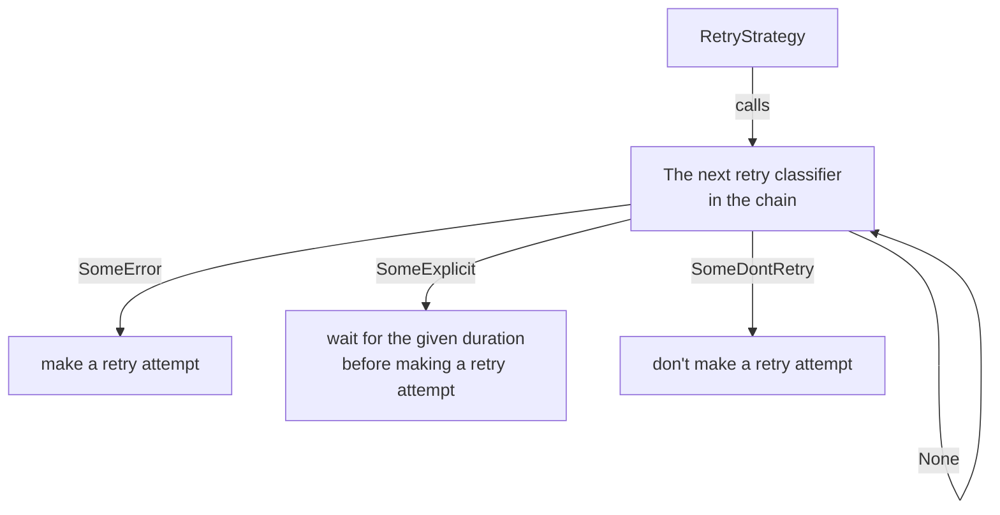

# RFC: User-configurable retry classification

> Status: RFC
>
> Applies to: client

For a summarized list of proposed changes, see the [Changes Checklist](#changes-checklist) section.

This RFC defines the user experience and implementation of user-configurable retry classification. Custom retry classifiers enable users to change what responses are retried while still allowing them to rely on defaults set by SDK authors when desired.
## Terminology

- **Smithy Service**: An HTTP service, whose API is modeled with the [Smithy IDL](https://www.smithy.io).
- **Smithy Client**: An HTTP client generated by smithy-rs from a `.smithy` model file.
- **AWS SDK**: A **smithy client** that's specifically configured to work with an AWS service.
- **Operation**: A modeled interaction with a service, defining the proper input and expected output shapes, as well as important metadata related to request construction. "Sending" an operation implies sending one or more HTTP requests to a **Smithy service**, and then receiving an output or error in response.
- **Orchestrator**: The client code which manages the request/response pipeline. The orchestrator is responsible for: 
	- Constructing, serializing, and sending requests.
	- Receiving, deserializing, and (optionally) retrying requests.
	- Running interceptors *(not covered in this RFC)* and handling errors.
- **Runtime Component**: A part of the orchestrator responsible for a specific function. Runtime components are used by the orchestrator itself, may depend on specific configuration, and must not be changed by interceptors. Examples include the endpoint resolver, retry strategy, and request signer.
- **Runtime Plugin**: Code responsible for setting and **runtime components** and related configuration. Runtime plugins defined by codegen are responsible for setting default configuration and altering the behavior of **Smithy clients** including the **AWS SDKs**.
- **Retry Strategy**: The process by which the orchestrator determines when and how to retry failed requests. Only one retry strategy may be set. The retry strategy depends upon the **retry classifier** to interpret responses and determine if they are retryable.
- **Retry Classifier**: Code responsible for introspecting the request/response pipelines and determining if a retry is necessary. Multiple retry classifiers may be combined into a **retry classifier chain**.
- **Retry Classifier Chain**: Requests can fail for any number of reasons, but retry classifiers are specific, meaning that they target a narrow range of possibilities. Rather than define a single retry classifier to handle all possible outcomes, multiple classifiers are chained together. Each classifier is run in turn, and the chain ends when a classifier decides a response is retryable, or a classifier may determine that a response must not be retried, or after all classifiers have run and haven't decided a retry is necessary.
- **Retry Classifier Priority**: Retry classifiers in different places and times before sending a request. Each classifier has a defined priority that enables them to be sorted correctly. When implementing your own classifier, you may set your own priority.
## The user experience if this RFC is implemented

In the current version of the SDK, users are unable to configure retry classification, except by defining a custom retry strategy. Once this RFC is implemented, users will be able to define their own classifiers and set them at the service level and/or the operation level.

### Defining a custom retry classifier

```rust
use aws_smithy_runtime::client::retries::{ClassifyRetry, RetryClassifierResult};
use aws_smithy_runtime::client::interceptors::context::InterceptorContext;

#[derive(Debug)]
struct CustomRetryClassifier;

impl ClassifyRetry for CustomRetryClassifier {
    fn classify_retry(
        &self,
        ctx: &InterceptorContext,
        result_of_preceding_classifier: Option<RetryClassifierResult>,
    ) -> Option<RetryClassifierResult> {
		// It's typical, but not required, to respect the judgement of the
	    // preceding classifier and forward it on.
		if let Some(result) = result_of_preceding_classifier {
			return result;
		}

		todo!("inspect the interceptor context to determine if a retry attempt should be made.")
	}

	fn name(&self) -> &'static str { "my custom retry classifier" }
}
```
### Customizing retry classification for a service

```rust
#[tokio::main]
async fn main() -> Result<(), aws_sdk_s3::Error> {
    let sdk_config = aws_config::load_from_env().await;
    let service_config = aws_sdk_s3::Config::from(&sdk_config)
	    .to_builder()
	    .retry_classifier(CustomRetryClassifier)
	    .build()
    let client = aws_sdk_s3::Client::from_conf(&service_config);

    let res = client
	    .list_buckets()
	    .send()
	    .await?;

	println!("your buckets: {res:?}");

    Ok(())
}
```

### Customizing retry classification for an operation

```rust
#[tokio::main]
async fn main() -> Result<(), aws_sdk_s3::Error> {
    let sdk_config = aws_config::load_from_env().await;
    let client = aws_sdk_s3::Client::new(&sdk_config);

    let res = client
	    .list_buckets()
        .customize()
        .await
        .unwrap()
        .config_override(   
            aws_sdk_s3::Config::builder()
	            .retry_classifier(CustomRetryClassifier)
        )
        .send()
        .await?;

	println!("your buckets: {res:?}");

    Ok(())
}
```

## How to actually implement this RFC

In order to implement this feature, we must:
- Update the current retry classification system so that individual classifiers as well as collections of classifiers can be easily composed together.
- Create two new configuration mechanisms for users that allow them to customize retry classification at the service level and at the operation level.
- Update retry classifiers so that they may 'short-circuit' the chain, ending retry classification immediately.

### The `RetryClassifier` trait

```rust
/// The result of running a [`ClassifyRetry`] on a [`InterceptorContext`].
#[non_exhaustive]
#[derive(Clone, Eq, PartialEq, Debug)]
pub enum RetryAction {
    /// "A retryable error was received. This is what kind of error it was,
    /// in case that's important."
    Retry(ErrorKind),
    /// "The server told us to wait this long before retrying the request."
    RetryAfter(Duration),
    /// "This response should not be retried."
    NoRetry,
}

/// Classifies what kind of retry is needed for a given [`InterceptorContext`].  
pub trait ClassifyRetry: Send + Sync + fmt::Debug {
    /// Run this classifier on the [`InterceptorContext`] to determine if the previous request
    /// should be retried. Returns a [`RetryClassifierResult`].  
    fn classify_retry(
        &self,
        ctx: &InterceptorContext,
        result_of_preceding_classifier: Option<RetryClassifierResult>,
    ) -> Option<RetryClassifierResult>;

    /// The name of this retry classifier.
    ///
    /// Used for debugging purposes
    fn name(&self) -> &'static str;

    /// The priority of this retry classifier. Classifiers with a higher priority will run before
    /// classifiers with a lower priority. Classifiers with equal priorities make no guarantees
    /// about which will run first.
    fn priority(&self) -> RetryClassifierPriority {
        RetryClassifierPriority::default()
    }
}
```

### Chaining retry classifiers

Multiple retry classifiers are chained by wrapping classifiers inside one another. When classifiers must be wrapped in a specific order, use a specific type for the inner classifier. When classifiers must be composable in any order, use a referenced trait object. This approach is demonstrated in the following example code:

```rust
struct ExampleRetryClassifier<'a> {
	inner: Option<&'a dyn ClassifyRetry>
}

impl<'a> ClassifyRetry for ExampleRetryClassifier<'a> {
    fn classify_retry(
        &self,
        ctx: &InterceptorContext,
        result_of_preceding_classifier: Option<RetryClassifierResult>,
    ) -> Option<RetryClassifierResult> {
	    // It's typical, but not required, to respect the judgement of the
	    // preceding classifier and forward it on.
		if let Some(result) = result_of_preceding_classifier {
			return result;
		}

		// Do retry classification here...
		// Assume that we found a retryable server error
		Some(RetryClassifierResult::Error(ErrorKind::ServerError))
	}
}
```

When each classifier in the chain reports the result of running it, debugging the result of classification is easy:

```txt
running 'errors modeled as retryable' classifier resulted in 'continue'
running 'retryable smithy errors' classifier resulted in 'continue'
running 'http status code' classifier resulted in 'retry (server error)'
```
### The retry classifier state machine and `RetryClassifierResult`

It's up to each chained classifier to respect the decision made by earlier links in the chain. When properly chained, the classifiers can be thought of as a state machine:


It is possible for a wrapping classifier to ignore inner classifiers, but this is not considered typical behavior. The cases where an inner classifier would be ignored MUST be clearly documented.

### Setting a retry classifier with a runtime plugin

Wrapping retry classifiers may be set with a runtime plugin. When setting a classifier with this method, the runtime plugin is responsible for extracting any previously-set classifier and wrapping it.

```rust
impl<'a> ExampleRetryClassifier<'a> {
	pub fn new(inner: Option<&'a dyn ClassifyRetry>) -> Self {
		Self { inner }
	}
}

struct ExampleRetryClassifierRuntimePlugin;

impl RuntimePlugin for ExampleRetryClassifierRuntimePlugin {
	fn runtime_components(  
	    &self,  
	    current_components: &RuntimeComponentsBuilder,  
	) -> Cow<'_, RuntimeComponentsBuilder> {
	
	    let rcb = RuntimeComponentsBuilder::new("ExampleRetryClassifierRuntimePlugin")
		    .with_retry_classifier(
			    ExampleRetryClassifier::new(current_components.retry_classifier())
		    );

	    Cow::Owned(rcb)
	}
}
```

By default, newer runtime plugins will override previously-set plugins. This is important to consider when deciding how your classifier will wrap other classifiers.

## Changes checklist

- [ ] Make retry classifiers composable by runtime plugins.
- [ ] Enable configuration of retry classifiers at the service level.
- [ ] Enable configuration of retry classifiers at the operation level.
- [ ] Replace `RetryReason` with `RetryClassifierResult`.
	- [ ] Add variant for `DontRetry`
	- [ ] Add variant for `Continue`
