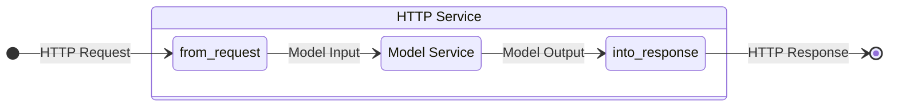
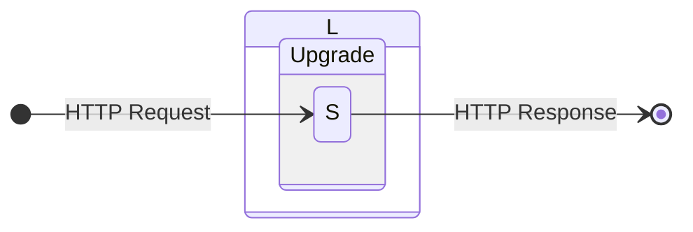
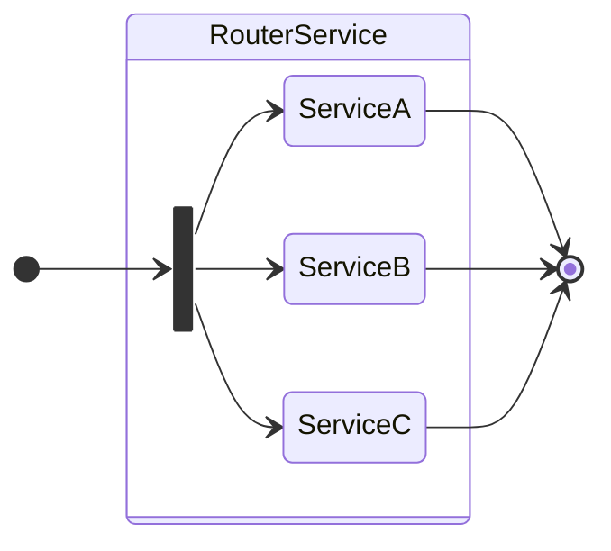
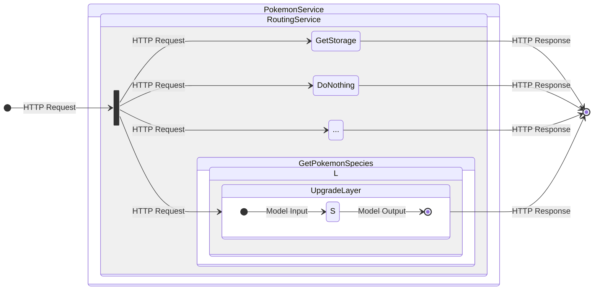
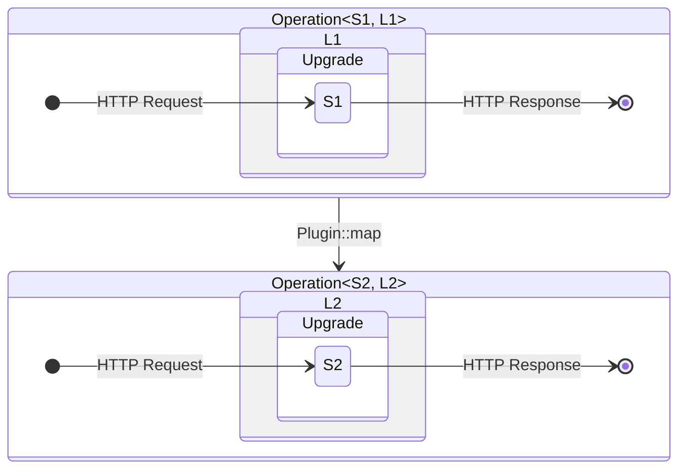

# The Anatomy of a Service

What is [Smithy](https://awslabs.github.io/smithy/2.0/index.html)? At a high-level, it's a grammar for specifying services while leaving the business logic undefined. A [Smithy Service](https://awslabs.github.io/smithy/2.0/spec/service-types.html#service) specifies a collection of function signatures in the form of [Operations](https://awslabs.github.io/smithy/2.0/spec/service-types.html#operation), their purpose is to encapsulate business logic. A Smithy implementation should, for each Smithy Service, provide a builder, which accepts functions conforming to said signatures, and returns a service subject to the semantics specified by the model.

This survey is disinterested in the actual Kotlin implementation of the code generator, and instead focuses on the structure of the generated Rust code and how it relates to the Smithy model. The intended audience is new contributors and users interested in internal details.

During the survey we will use the [`pokemon.smithy`](https://github.com/awslabs/smithy-rs/blob/main/codegen-core/common-test-models/pokemon.smithy) model as a reference:

```smithy
/// A Pokémon species forms the basis for at least one Pokémon.
@title("Pokémon Species")
resource PokemonSpecies {
    identifiers: {
        name: String
    },
    read: GetPokemonSpecies,
}

/// A users current Pokémon storage.
resource Storage {
    identifiers: {
        user: String
    },
    read: GetStorage,
}

/// The Pokémon Service allows you to retrieve information about Pokémon species.
@title("Pokémon Service")
@restJson1
service PokemonService {
    version: "2021-12-01",
    resources: [PokemonSpecies, Storage],
    operations: [
        GetServerStatistics,
        DoNothing,
        CapturePokemon,
        CheckHealth
    ],
}
```

Smithy Rust will use this model to produce the following API:

```rust
// A handler for the `GetPokemonSpecies` operation (the `PokemonSpecies` resource).
async fn get_pokemon_species(input: GetPokemonSpeciesInput) -> Result<GetPokemonSpeciesOutput, GetPokemonSpeciesError> {
    /* implementation */
}

// Apply a `tower::Layer` to a handler.
let get_pokemon_species_op = GetPokemonSpecies::from_handler(get_pokemon_species).layer(/* some `tower::Layer` */);

// Use the service builder to create `PokemonService`.
let pokemon_service = PokemonService::builder_without_plugins()
    // Pass the handler directly to the service builder...
    .get_pokemon_species(get_pokemon_species)
    // ...or pass the layered handler.
    .get_pokemon_species_operation(get_pokemon_species_op)
    /* other operation setters */
    .build()
    .expect("failed to create an instance of the Pokémon service");
```

## Operations

A [Smithy Operation](https://awslabs.github.io/smithy/2.0/spec/service-types.html#operation) specifies the input, output, and possible errors of an API operation. One might characterize a Smithy Operation as syntax for specifying a function type.

We represent this in Rust using the [`OperationShape`](https://github.com/awslabs/smithy-rs/blob/4c5cbc39384f0d949d7693eb87b5853fe72629cd/rust-runtime/aws-smithy-http-server/src/operation/shape.rs#L8-L22) trait:

```rust
pub trait OperationShape {
    /// The name of the operation.
    const NAME: &'static str;

    /// The operation input.
    type Input;
    /// The operation output.
    type Output;
    /// The operation error. [`Infallible`](std::convert::Infallible) in the case where no error
    /// exists.
    type Error;
}
```

For each Smithy Operation shape,

```smithy
/// Retrieve information about a Pokémon species.
@readonly
@http(uri: "/pokemon-species/{name}", method: "GET")
operation GetPokemonSpecies {
    input: GetPokemonSpeciesInput,
    output: GetPokemonSpeciesOutput,
    errors: [ResourceNotFoundException],
}
```

the following implementation is generated

```rust
/// Retrieve information about a Pokémon species.
pub struct GetPokemonSpecies;

impl OperationShape for GetPokemonSpecies {
    const NAME: &'static str = "com.aws.example#GetPokemonSpecies";

    type Input = GetPokemonSpeciesInput;
    type Output = GetPokemonSpeciesOutput;
    type Error = GetPokemonSpeciesError;
}
```

where `GetPokemonSpeciesInput`, `GetPokemonSpeciesOutput` are both generated from the Smithy structures and `GetPokemonSpeciesError` is an enum generated from the `errors: [ResourceNotFoundException]`.

Note that the `GetPokemonSpecies` marker structure is a zero-sized type (ZST), and therefore does not exist at runtime - it is a way to attach operation-specific data on an entity within the type system.

The following nomenclature will aid us in our survey. We describe a `tower::Service` as a "model service" if its request and response are Smithy structures, as defined by the `OperationShape` trait - the `GetPokemonSpeciesInput`, `GetPokemonSpeciesOutput`, and `GetPokemonSpeciesError` described above. Similarly, we describe a `tower::Service` as a "HTTP service" if its request and response are [`http`](https://github.com/hyperium/http) structures - `http::Request` and `http::Response`.

In contrast to the marker ZSTs above, the [`Operation<S, L>`](https://github.com/awslabs/smithy-rs/blob/4c5cbc39384f0d949d7693eb87b5853fe72629cd/rust-runtime/aws-smithy-http-server/src/operation/mod.rs#L192-L198) structure holds the actual runtime behavior of an operation, which is specified, during construction, by the customer.

```rust
/// A Smithy operation, represented by a [`Service`](tower::Service) `S` and a [`Layer`](tower::Layer) `L`.
///
/// The `L` is held and applied lazily during [`Upgradable::upgrade`].
pub struct Operation<S, L = Identity> {
    inner: S,
    layer: L,
}
```

The `S` here is a model service, this is specified during construction of the `Operation<S, L>`. The constructors exist on the marker ZSTs as an extension trait to `OperationShape`, namely [`OperationShapeExt`](https://github.com/awslabs/smithy-rs/blob/4c5cbc39384f0d949d7693eb87b5853fe72629cd/rust-runtime/aws-smithy-http-server/src/operation/shape.rs#L24-L45):

```rust
/// An extension trait over [`OperationShape`].
pub trait OperationShapeExt: OperationShape {
    /// Creates a new [`Operation`] for well-formed [`Handler`]s.
    fn from_handler<H>(handler: H) -> Operation<IntoService<Self, H>>
    where
        H: Handler<Self>,
        Self: Sized,
    {
        Operation::from_handler(handler)
    }

    /// Creates a new [`Operation`] for well-formed [`Service`](tower::Service)s.
    fn from_service<S>(svc: S) -> Operation<Normalize<Self, S>>
    where
        S: OperationService<Self>,
        Self: Sized,
    {
        Operation::from_service(svc)
    }
}
```

Observe that there are two constructors provided: `from_handler` which takes a `H: Handler` and `from_service` which takes a `S: OperationService`. In both cases `Self` is passed as a parameter to the traits - this constrains `handler: H` and `svc: S` to the signature given by the implementation of `OperationShape` on `Self`.

The [`Handler`](https://github.com/awslabs/smithy-rs/blob/4c5cbc39384f0d949d7693eb87b5853fe72629cd/rust-runtime/aws-smithy-http-server/src/operation/handler.rs#L21-L29) and [`OperationService`](https://github.com/awslabs/smithy-rs/blob/4c5cbc39384f0d949d7693eb87b5853fe72629cd/rust-runtime/aws-smithy-http-server/src/operation/operation_service.rs#L15-L29) both serve a similar purpose - they provide a common interface for converting to a model service `S`.

- The `Handler<GetPokemonSpecies>` trait covers all async functions taking `GetPokemonSpeciesInput` and asynchronously returning a `Result<GetPokemonSpeciesOutput, GetPokemonSpeciesError>`.
- The `OperationService<GetPokemonSpecies>` trait covers all `tower::Service`s with request `GetPokemonSpeciesInput`, response `GetPokemonSpeciesOutput` and error `GetPokemonSpeciesOutput`.

The `from_handler` constructor is used in the following way:

```rust
async fn get_pokemon_service(input: GetPokemonServiceInput) -> Result<GetPokemonServiceOutput, GetPokemonServiceError> {
    /* Handler logic */
}

let operation = GetPokemonService::from_handler(get_pokemon_service);
```

Alternatively, `from_service` constructor:

```rust
struct Svc {
    /* ... */
}

impl Service<GetPokemonServiceInput> for Svc {
    type Response = GetPokemonServiceOutput;
    type Error = GetPokemonServiceError;

    /* ... */
}

let svc: Svc = /* ... */;
let operation = GetPokemonService::from_service(svc);
```

To summarize, the `S`, in `Operation<S, L>`, is a _model service_ constructed from a `Handler` or a `OperationService` subject to the constraints of an `OperationShape`. More detailed information on these conversions is provided in the [Handler and OperationService section](https://github.com/awslabs/smithy-rs/blob/39c0096c33417d44f125a042c112b3c16918098a/rust-runtime/aws-smithy-http-server/src/operation/mod.rs#L50-L100) Rust docs.

Now, what about the `L` in `Operation<S, L>`? The `L` is a [`tower::Layer`](https://docs.rs/tower/latest/tower/layer/trait.Layer.html), or colloquially "middleware", that is applied to a _HTTP service_. Note that this means that `L` is _not_ applied directly to `S`. We can append to `L` using the `Operation::layer` method:

```rust
impl<S, L> Operation<S, L> {
    /// Applies a [`Layer`] to the operation _after_ it has been upgraded via [`Operation::upgrade`].
    pub fn layer<NewL>(self, layer: NewL) -> Operation<S, Stack<L, NewL>> {
        Operation {
            inner: self.inner,
            layer: Stack::new(self.layer, layer),
        }
    }
}
```

where [`tower::layer::util::Stack`](https://docs.rs/tower/latest/tower/layer/util/struct.Stack.html) is used to chain layers together.

A typical use of this might be:

```rust
let operation = GetPokemonSpecies::from_handler(handler).layer(RequestBodyLimitLayer::new(500));
```

where [`RequestBodyLimitLayer`](https://docs.rs/tower-http/latest/tower_http/limit/struct.RequestBodyLimitLayer.html) limits the size of the HTTP request body to the `GetPokemonSpecies` operation.

As mentioned, `L` is applied _after_ the `Operation<S, L>` has been "upgraded" to a HTTP service. The procedure of upgrading a model service to a HTTP service is described in the [Upgrading a Model Service](#upgrading-a-model-service) section below.

## Serialization and Deserialization

A [Smithy protocol](https://awslabs.github.io/smithy/2.0/spec/protocol-traits.html#serialization-and-protocol-traits) specifies the serialization/deserialization scheme - how a HTTP request is transformed into a modelled input and a modelled output to a HTTP response. The is formalized using the [`FromRequest`](https://github.com/awslabs/smithy-rs/blob/4c5cbc39384f0d949d7693eb87b5853fe72629cd/rust-runtime/aws-smithy-http-server/src/request.rs#L156-L164) and [`IntoResponse`](https://github.com/awslabs/smithy-rs/blob/4c5cbc39384f0d949d7693eb87b5853fe72629cd/rust-runtime/aws-smithy-http-server/src/response.rs#L40-L44) traits:

```rust
/// Provides a protocol aware extraction from a [`Request`]. This consumes the
/// [`Request`], in contrast to [`FromParts`].
pub trait FromRequest<Protocol>: Sized {
    type Rejection: IntoResponse<Protocol>;
    type Future: Future<Output = Result<Self, Self::Rejection>>;

    /// Extracts `self` from a [`Request`] asynchronously.
    fn from_request(request: http::Request) -> Self::Future;
}

/// A protocol aware function taking `self` to [`http::Response`].
pub trait IntoResponse<Protocol> {
    /// Performs a conversion into a [`http::Response`].
    fn into_response(self) -> http::Response<BoxBody>;
}
```

Note that both traits are parameterized by `Protocol`. These [protocols](https://awslabs.github.io/smithy/2.0/aws/protocols/index.html) exist as ZST marker structs:

```rust
/// [AWS REST JSON 1.0 Protocol](https://awslabs.github.io/smithy/2.0/aws/protocols/aws-restjson1-protocol.html).
pub struct RestJson1;

/// [AWS REST XML Protocol](https://awslabs.github.io/smithy/2.0/aws/protocols/aws-restxml-protocol.html).
pub struct RestXml;

/// [AWS JSON 1.0 Protocol](https://awslabs.github.io/smithy/2.0/aws/protocols/aws-json-1_0-protocol.html).
pub struct AwsJson1_0;

/// [AWS JSON 1.1 Protocol](https://awslabs.github.io/smithy/2.0/aws/protocols/aws-json-1_1-protocol.html).
pub struct AwsJson1_1;
```

## Upgrading a Model Service

We can "upgrade" a model service to a HTTP service using `FromRequest` and `IntoResponse` described in the prior section:



This is formalized by the [`Upgrade<Protocol, Op, S>`](https://github.com/awslabs/smithy-rs/blob/9a6de1f533f8743dbbc3fa6ad974d104c8b841f4/rust-runtime/aws-smithy-http-server/src/operation/upgrade.rs#L74-L82) HTTP service. The `tower::Service` implementation is approximately:

```rust
impl<P, Op, S> Service<http::Request> for Upgrade<P, Op, S>
where
    // `Op` is used to specify the operation shape
    Op: OperationShape,
    // Smithy input must convert from a HTTP request
    Op::Input: FromRequest<P>,
    // Smithy output must convert into a HTTP response
    Op::Output: IntoResponse<P>,
    // Smithy error must convert into a HTTP response
    OpError: IntoResponse<P>,

    // The signature of the inner service is correct
    S: Service<Op::Input, Response = Op::Output, Error = Op::Error>,

    async fn call(&mut self, request: http::Request) -> http::Response {
        let model_request = match <Op::Input as OperationShape>::from_request(request).await {
            Ok(ok) => ok,
            Err(err) => return err.into_response()
        };
        let model_response = self.model_service.call(model_request).await;
        model_response.into_response()
    }
```

When we `GetPokemonService::from_handler` or `GetPokemonService::from_service`, the model service produced, `S`, will meet the constraints above.

There is an associated `Layer`, `UpgradeLayer<P, Op, B>` which constructs `Upgrade` from a service.

The upgrade procedure is finalized by the application of the `Layer` `L`, referenced in `Operation<S, L>`. In this way the entire upgrade procedure takes an `Operation<S, L>` and returns a HTTP service.



Note that the `S` and `L` are specified by logic written, in Rust, by the customer, whereas `Upgrade`/`UpgradeLayer` is specified entirely by Smithy model via the protocol, [HTTP bindings](https://awslabs.github.io/smithy/2.0/spec/http-bindings.html), etc.

The procedure of taking a struct and transforming it into a HTTP service is formalized by the [`Upgradable`](https://github.com/awslabs/smithy-rs/blob/9a6de1f533f8743dbbc3fa6ad974d104c8b841f4/rust-runtime/aws-smithy-http-server/src/operation/upgrade.rs#L220-L225) trait:

```rust
/// An interface to convert a representation of a Smithy operation into a [`Route`].
pub trait Upgradable<Protocol, Operation> {
    /// Upgrade the representation of a Smithy operation to a [`Route`].
    fn upgrade(self, plugin: &Plugin) -> Route<Body>;
}
```

Why do we need a trait for this? Why not simply write an `upgrade` method on `Operation<S, L>`? The reason is that we might _not_ want to supply an `Operation<S, L>` to the service builder, instead we might want to supply something that overrides the typical upgrade procedure.

Below we give an example of a ZST which can be provided to the builder, which also satisfies `Upgradable` and returns a `MissingFailure` `tower::Service`. This `MissingFailure` service simply returns a status code 500.

```rust
/// A marker struct indicating an [`Operation`] has not been set in a builder.
///
/// This _does_ implement [`Upgradable`] but produces a [`Service`] which always returns an internal failure message.
pub struct FailOnMissingOperation;

impl<Protocol, Operation> Upgradable<Protocol, Operation> for FailOnMissingOperation
where
    InternalFailureException: IntoResponse<Protocol>,
    Protocol: 'static,
{
    fn upgrade(self, _plugin: &Plugin) -> Route<Body> {
        Route::new(MissingFailure { _protocol: PhantomData })
    }
}
```

We go into more detail on how the `Upgradable` trait is used in conjunction with builders in the [Builders](#builders) section below.

## Routers

Different protocols supported by Smithy enjoy different routing mechanisms, for example, [AWS JSON 1.0](https://awslabs.github.io/smithy/2.0/aws/protocols/aws-json-1_0-protocol.html#protocol-behaviors) uses the `X-Amz-Target` header to select an operation, whereas [AWS REST XML](https://awslabs.github.io/smithy/2.0/aws/protocols/aws-restxml-protocol.html) uses the [HTTP label trait](https://awslabs.github.io/smithy/2.0/spec/http-bindings.html#httplabel-trait).

Despite their differences, all routing mechanisms satisfy a common interface. This is formalized using the `Router` trait:

```rust
/// An interface for retrieving an inner [`Service`] given a [`http::Request`].
pub trait Router {
    type Service;
    type Error;

    /// Matches a [`http::Request`] to a target [`Service`].
    fn match_route(&self, request: &http::Request) -> Result<Self::Service, Self::Error>;
}
```

which provides the ability to determine an inner HTTP service from a collection using a `&http::Request`.

Types which implement the `Router` trait are converted to a HTTP service via the `RoutingService` struct:

```rust
/// A [`Service`] using a [`Router`] `R` to redirect messages to specific routes.
///
/// The `Protocol` parameter is used to determine the serialization of errors.
pub struct RoutingService<R, Protocol> {
    router: R,
    _protocol: PhantomData<Protocol>,
}

impl<R, P> Service<http::Request> for RoutingService<R, P>
where
    R: Router<B>,
    R::Service: Service<http::Request, Response = http::Response>,
    R::Error: IntoResponse<P> + Error,
{
    type Response = http::Response;
    type Error = /* implementation detail */;

    async fn call(&mut self, req: http::Request<B>) -> Result<Self::Response, Self::Error> {
        match self.router.match_route(&req) {
            // Successfully routed, use the routes `Service::call`.
            Ok(ok) => ok.oneshot(req).await,
            // Failed to route, use the `R::Error`s `IntoResponse<P>`.
            Err(error) => {
                debug!(%error, "failed to route");
                Err(Box::new(error.into_response()))
            }
        }
    }
}
```

The `RouterService` is the final piece necessary to form a functioning composition - it is used to aggregate together the HTTP services, created via the upgrade procedure, into a single HTTP service which can be presented to the customer.



## Builders

The service builder is the primary public API, generated for every [Smithy Service](https://awslabs.github.io/smithy/2.0/spec/service-types.html).
At a high-level, the service builder takes as input a function for each Smithy Operation and returns a single HTTP service. The signature of each function, also known as _handlers_, must match the constraints of the corresponding Smithy model.

You can create an instance of a service builder by calling either `builder_without_plugins` or `builder_with_plugins` on the corresponding service struct.

> Plugins? What plugins? Don't worry, they'll be covered in a [dedicated section](#plugins) later on!

```rust
/// The service builder for [`PokemonService`].
///
/// Constructed via [`PokemonService::builder`].
pub struct PokemonServiceBuilder<Body, Plugin> {
    capture_pokemon_operation: Option<Route<Body>>,
    empty_operation: Option<Route<Body>>,
    get_pokemon_species: Option<Route<Body>>,
    get_server_statistics: Option<Route<Body>>,
    get_storage: Option<Route<Body>>,
    health_check_operation: Option<Route<Body>>,
    plugin: Plugin
}
```

The builder has two setter methods for each [Smithy Operation](https://awslabs.github.io/smithy/2.0/spec/service-types.html#operation) in the [Smithy Service](https://awslabs.github.io/smithy/2.0/spec/service-types.html#service):

```rust
    /// Sets the [`GetPokemonSpecies`](crate::operation_shape::GetPokemonSpecies) operation.
    ///
    /// This should be an async function satisfying the [`Handler`](aws_smithy_http_server::operation::Handler) trait.
    /// See the [operation module documentation](aws_smithy_http_server::operation) for more information.
    pub fn get_pokemon_species<HandlerType, Extensions>(
        self,
        handler: HandlerType,
    ) -> Self
    where
        HandlerType: Handler<GetPokemonSpecies, Extensions>,
        Operation<IntoService<GetPokemonSpecies, HandlerType>>:
            Upgradable<RestJson1, GetPokemonSpecies, Extensions, Body, Plugin>,
    {
        self.get_pokemon_species_operation(GetPokemonSpecies::from_handler(handler))
    }

    /// Sets the [`GetPokemonSpecies`](crate::operation_shape::GetPokemonSpecies) operation.
    ///
    /// This should be an [`Operation`](aws_smithy_http_server::operation::Operation) created from
    /// [`GetPokemonSpecies`](crate::operation_shape::GetPokemonSpecies) using either
    /// [`OperationShape::from_handler`](aws_smithy_http_server::operation::OperationShapeExt::from_handler) or
    /// [`OperationShape::from_service`](aws_smithy_http_server::operation::OperationShapeExt::from_service).
    pub fn get_pokemon_species_operation<Operation, Extensions>(
        self,
        operation: Operation,
    ) -> Self
    where
        Operation: Upgradable<RestJson1, GetPokemonSpecies, Extensions, Body, Plugin>,
    {
        self.get_pokemon_species = Some(operation.upgrade(&self.plugin))
    }
```

Handlers and operations are upgraded to a [`Route`](https://github.com/awslabs/smithy-rs/blob/4c5cbc39384f0d949d7693eb87b5853fe72629cd/rust-runtime/aws-smithy-http-server/src/routing/route.rs#L49-L52) as soon as they are registered against the service builder. You can think of `Route` as a boxing layer in disguise.

You can transform a builder instance into a complete service (`PokemonService`) using one of the following methods:

- `build`. The transformation fails if one or more operations do not have a registered handler;
- `build_unchecked`. The transformation never fails, but we return `500`s for all operations that do not have a registered handler.

Both builder methods take care of:

1. Pair each handler with the routing information for the corresponding operation;
2. Collect all `(routing_info, handler)` pairs into a `Router`;
3. Transform the `Router` implementation into a HTTP service via `RouterService`;
4. Wrap the `RouterService` in a newtype given by the service name, `PokemonService`.

The final outcome, an instance of `PokemonService`, looks roughly like this:

```rust
/// The Pokémon Service allows you to retrieve information about Pokémon species.
#[derive(Clone)]
pub struct PokemonService<S> {
    router: RoutingService<RestRouter<S>, RestJson1>,
}
```

The following schematic summarizes the composition:



## Plugins
<!-- TODO(missing_doc): Link to "Write a Plugin" documentation -->

There are a variety of places in which the customer can apply middleware. During the build:

- For a specific operation, for example `GetPokemonSpecies`, the model service can be wrapped by a `Layer` before passing it to `GetPokemonSpecies::from_service` constructor.
- The `Operation::layer` method can be used to apply a `Layer` to a specific operation _after_ it's been upgraded.

After the build is finalized:

- The entire `PokemonService` HTTP service can be wrapped by a `Layer`.
- Every `Route` in the `Router` can be wrapped by a `Layer` using `PokemonService::layer`.

Although this provides a reasonably "complete" API, it can be cumbersome in some use cases. Suppose a customer wants to log the operation name when a request is routed to said operation. Writing a `Layer`, `NameLogger`, to log an operation name is simple, however with the current API the customer is forced to do the following

```rust
let get_pokemon_species = GetPokemonSpecies::from_handler(/* handler */).layer(NameLogger::new("GetPokemonSpecies"));
let get_storage = GetStorage::from_handler(/* handler */).layer(NameLogger::new("GetStorage"));
let do_nothing = DoNothing::from_handler(/* handler */).layer(NameLogger::new("DoNothing"));
/* Repeat for every route... */
```

Note that `PokemonService::layer` cannot be used here because it applies a _single_ layer uniformly across all `Route`s stored in the `Router`.

```rust
impl<S> PokemonService<S> {
    /// Applies a [`Layer`](tower::Layer) uniformly to all routes.
    pub fn layer<L>(self, layer: &L) -> PokemonService<L::Service>
    where
        L: Layer<S>,
    {
        PokemonService {
            router: self.router.map(|s| s.layer(layer)),
        }
    }
}
```

The plugin system solves the general problem of modifying `Operation<S, L>` prior to the upgrade procedure in a way parameterized by the protocol and operation marker structures. This parameterization removes the excessive boilerplate above.

The central trait is [`Plugin`](https://github.com/awslabs/smithy-rs/blob/4c5cbc39384f0d949d7693eb87b5853fe72629cd/rust-runtime/aws-smithy-http-server/src/plugin.rs#L31-L41):

```rust
/// A mapping from one [`Operation`] to another. Used to modify the behavior of
/// [`Upgradable`](crate::operation::Upgradable) and therefore the resulting service builder.
///
/// The generics `Protocol` and `Op` allow the behavior to be parameterized.
pub trait Plugin<Protocol, Op, S, L> {
    type Service;
    type Layer;

    /// Maps an [`Operation`] to another.
    fn map(&self, input: Operation<S, L>) -> Operation<Self::Service, Self::Layer>;
}
```

The `Upgradable::upgrade` method on `Operation<S, L>`, previously presented in [Upgrading a Model Service](#upgrading-a-model-service), is more accurately:

```rust
    /// Takes the [`Operation<S, L>`](Operation), applies [`Plugin`], then applies [`UpgradeLayer`] to
    /// the modified `S`, then finally applies the modified `L`.
    ///
    /// The composition is made explicit in the method constraints and return type.
    fn upgrade(self, plugin: &Pl) -> Route<B> {
        let mapped = plugin.map(self);
        let layer = Stack::new(UpgradeLayer::new(), mapped.layer);
        Route::new(layer.layer(mapped.inner))
    }
```



An example `Plugin` implementation can be found in [aws-smithy-http-server/examples/pokemon-service/src/plugin.rs](https://github.com/awslabs/smithy-rs/blob/main/rust-runtime/aws-smithy-http-server/examples/pokemon-service/src/plugin.rs).

The service builder API requires plugins to be specified upfront - they must be passed as an argument to `builder_with_plugins` and cannot be modified afterwards.
This constraint is in place to ensure that all handlers are upgraded using the same set of plugins.

You might find yourself wanting to apply _multiple_ plugins to your service.
This can be accommodated via [`PluginPipeline`].

```rust
use aws_smithy_http_server::plugin::PluginPipeline;
# use aws_smithy_http_server::plugin::IdentityPlugin as LoggingPlugin;
# use aws_smithy_http_server::plugin::IdentityPlugin as MetricsPlugin;

let pipeline = PluginPipeline::new().push(LoggingPlugin).push(MetricsPlugin);
```

The plugins' runtime logic is executed in registration order.
In the example above, `LoggingPlugin` would run first, while `MetricsPlugin` is executed last.

If you are vending a plugin, you can leverage `PluginPipeline` as an extension point: you can add custom methods to it using an extension trait.
For example:

```rust
use aws_smithy_http_server::plugin::{PluginPipeline, PluginStack};
# use aws_smithy_http_server::plugin::IdentityPlugin as LoggingPlugin;
# use aws_smithy_http_server::plugin::IdentityPlugin as AuthPlugin;

pub trait AuthPluginExt<CurrentPlugins> {
    fn with_auth(self) -> PluginPipeline<PluginStack<AuthPlugin, CurrentPlugins>>;
}

impl<CurrentPlugins> AuthPluginExt<CurrentPlugins> for PluginPipeline<CurrentPlugins> {
    fn with_auth(self) -> PluginPipeline<PluginStack<AuthPlugin, CurrentPlugins>> {
        self.push(AuthPlugin)
    }
}

let pipeline = PluginPipeline::new()
    .push(LoggingPlugin)
    // Our custom method!
    .with_auth();
```

## Accessing Unmodelled Data

An additional omitted detail is that we provide an "escape hatch" allowing `Handler`s and `OperationService`s to accept data that isn't modelled. In addition to accepting `Op::Input` they can accept additional arguments which implement the [`FromParts`](https://github.com/awslabs/smithy-rs/blob/4c5cbc39384f0d949d7693eb87b5853fe72629cd/rust-runtime/aws-smithy-http-server/src/request.rs#L114-L121) trait:

```rust
use http::request::Parts;

/// Provides a protocol aware extraction from a [`Request`]. This borrows the
/// [`Parts`], in contrast to [`FromRequest`].
pub trait FromParts<Protocol>: Sized {
    /// The type of the failures yielded extraction attempts.
    type Rejection: IntoResponse<Protocol>;

    /// Extracts `self` from a [`Parts`] synchronously.
    fn from_parts(parts: &mut Parts) -> Result<Self, Self::Rejection>;
}
```

This differs from `FromRequest` trait, introduced in [Serialization and Deserialization](#serialization-and-deserialization), as it's synchronous and has non-consuming access to [`Parts`](https://docs.rs/http/0.2.8/http/request/struct.Parts.html), rather than the entire [Request](https://docs.rs/http/0.2.8/http/request/struct.Request.html).

```rust
pub struct Parts {
    pub method: Method,
    pub uri: Uri,
    pub version: Version,
    pub headers: HeaderMap<HeaderValue>,
    pub extensions: Extensions,
    /* private fields */
}
```

This is commonly used to access types stored within [`Extensions`](https://docs.rs/http/0.2.8/http/struct.Extensions.html) which have been inserted by a middleware. An `Extension` struct implements `FromParts` to support this use case:

```rust
/// Generic extension type stored in and extracted from [request extensions].
///
/// This is commonly used to share state across handlers.
///
/// If the extension is missing it will reject the request with a `500 Internal
/// Server Error` response.
///
/// [request extensions]: https://docs.rs/http/latest/http/struct.Extensions.html
#[derive(Debug, Clone)]
pub struct Extension<T>(pub T);

impl<Protocol, T> FromParts<Protocol> for Extension<T>
where
    T: Clone + Send + Sync + 'static,
{
    type Rejection = MissingExtension;

    fn from_parts(parts: &mut http::request::Parts) -> Result<Self, Self::Rejection> {
        parts.extensions.remove::<T>().map(Extension).ok_or(MissingExtension)
    }
}

/// The extension has not been added to the [`Request`](http::Request) or has been previously removed.
#[derive(Debug, Error)]
#[error("the `Extension` is not present in the `http::Request`")]
pub struct MissingExtension;

impl<Protocol> IntoResponse<Protocol> for MissingExtension {
    fn into_response(self) -> http::Response<BoxBody> {
        let mut response = http::Response::new(empty());
        *response.status_mut() = StatusCode::INTERNAL_SERVER_ERROR;
        response
    }
}
```
