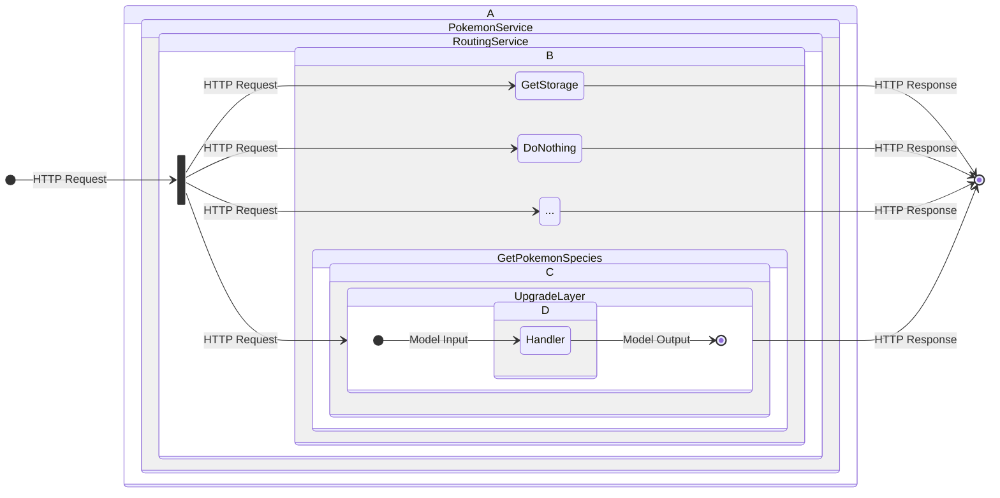

# Middleware

The following document provides a brief survey of the various positions middleware can be inserted in Smithy Rust.

We use the [Pokémon service](https://github.com/awslabs/smithy-rs/blob/main/codegen-core/common-test-models/pokemon.smithy) as a reference model throughout.

```smithy
/// A Pokémon species forms the basis for at least one Pokémon.
@title("Pokémon Species")
resource PokemonSpecies {
    identifiers: {
        name: String
    },
    read: GetPokemonSpecies,
}

/// A users current Pokémon storage.
resource Storage {
    identifiers: {
        user: String
    },
    read: GetStorage,
}

/// The Pokémon Service allows you to retrieve information about Pokémon species.
@title("Pokémon Service")
@restJson1
service PokemonService {
    version: "2021-12-01",
    resources: [PokemonSpecies, Storage],
    operations: [
        GetServerStatistics,
        DoNothing,
        CapturePokemon,
        CheckHealth
    ],
}
```

## Introduction to Tower

Smithy Rust is built on top of [`tower`](https://github.com/tower-rs/tower).

> Tower is a library of modular and reusable components for building robust networking clients and servers.

The `tower` library is centered around two main interfaces, the [`Service`](https://docs.rs/tower/latest/tower/trait.Service.html) trait and the [`Layer`](https://docs.rs/tower/latest/tower/trait.Layer.html) trait.

The `Service` trait can be thought of as an asynchronous function from a request to a response, `async fn(Request) -> Result<Response, Error>`, coupled with a mechanism to [handle back pressure](https://docs.rs/tower/latest/tower/trait.Service.html#backpressure), while the `Layer` trait can be thought of as a way of decorating a `Service`, transforming either the request or response.

Middleware in `tower` typically conforms to the following pattern, a `Service` implementation of the form

```rust
pub struct NewService<S> {
    inner: S,
    /* auxillary data */
}
```

and a complementary

```rust
pub struct NewLayer {
    /* auxiliary data */
}

impl<S> Layer<S> for NewLayer {
    type Service = NewService<S>;

    fn layer(&self, inner: S) -> Self::Service {
        NewService {
            inner,
            /* auxiliary fields */
        }
    }
}
```

The `NewService` modifies the behavior of the inner `Service` `S` while the `NewLayer` takes auxiliary data and constructs `NewService<S>` from `S`.

Customers are then able to stack middleware by composing `Layer`s using combinators such as [`ServiceBuilder::layer`](https://docs.rs/tower/latest/tower/struct.ServiceBuilder.html#method.layer) and [`Stack`](https://docs.rs/tower/latest/tower/layer/util/struct.Stack.html).

<!-- TODO(Update documentation): There's a `Layer` implementation on tuples about to be merged, give it as an example here. -->

## Applying Middleware

One of the primary goals is to provide configurability and extensibility through the application of middleware. The customer is able to apply `Layer`s in a variety of key places during the request/response lifecycle. The following schematic labels each configurable middleware position from A to D:



where `UpgradeLayer` is the `Layer` converting Smithy model structures to HTTP structures and the `RoutingService` is responsible for routing requests to the appropriate operation.

### A) Outer Middleware

The output of the Smithy service builder provides the user with a `Service<http::Request, Response = http::Response>` implementation. A `Layer` can be applied around the entire `Service`.

```rust
// This is a HTTP `Service`.
let app /* : PokemonService<Route<B>> */ = PokemonService::builder_without_plugins()
    .get_pokemon_species(/* handler */)
    /* ... */
    .build();

// Construct `TimeoutLayer`.
let timeout_layer = TimeoutLayer::new(Duration::from_secs(3));

// Apply a 3 second timeout to all responses.
let app = timeout_layer.layer(app);
```

### B) Route Middleware

A _single_ layer can be applied to _all_ routes inside the `Router`. This exists as a method on the output of the service builder.

```rust
// Construct `TraceLayer`.
let trace_layer = TraceLayer::new_for_http(Duration::from_secs(3));

let app /* : PokemonService<Route<B>> */ = PokemonService::builder_without_plugins()
    .get_pokemon_species(/* handler */)
    /* ... */
    .build()
    // Apply HTTP logging after routing.
    .layer(&trace_layer);
```

Note that requests pass through this middleware immediately _after_ routing succeeds and therefore will _not_ be encountered if routing fails. This means that the [TraceLayer](https://docs.rs/tower-http/latest/tower_http/trace/struct.TraceLayer.html) in the example above does _not_ provide logs unless routing has completed. This contrasts to [middleware A](#a-outer-middleware), which _all_ requests/responses pass through when entering/leaving the service.

### C) Operation Specific HTTP Middleware

A "HTTP layer" can be applied to specific operations.

```rust
// Construct `TraceLayer`.
let trace_layer = TraceLayer::new_for_http(Duration::from_secs(3));

// Apply HTTP logging to only the `GetPokemonSpecies` operation.
let layered_handler = GetPokemonSpecies::from_handler(/* handler */).layer(trace_layer);

let app /* : PokemonService<Route<B>> */ = PokemonService::builder_without_plugins()
    .get_pokemon_species_operation(layered_handler)
    /* ... */
    .build();
```

This middleware transforms the operations HTTP requests and responses.

### D) Operation Specific Model Middleware

A "model layer" can be applied to specific operations.

```rust
// A handler `Service`.
let handler_svc = service_fn(/* handler */);

// Construct `BufferLayer`.
let buffer_layer = BufferLayer::new(3);

// Apply a 3 item buffer to `handler_svc`.
let handler_svc = buffer_layer.layer(handler_svc);

let layered_handler = GetPokemonSpecies::from_service(handler_svc);

let app /* : PokemonService<Route<B>> */ = PokemonService::builder_without_plugins()
    .get_pokemon_species_operation(layered_handler)
    /* ... */
    .build();
```

In contrast to [position C](#c-operation-specific-http-middleware), this middleware transforms the operations modelled inputs to modelled outputs.

## Plugin System

Suppose we want to apply a different `Layer` to every operation. In this case, position B (`PokemonService::layer`) will not suffice because it applies a single `Layer` to all routes and while position C (`Operation::layer`) would work, it'd require the customer constructs the `Layer` by hand for every operation.

Consider the following middleware:

```rust
/// A [`Service`] that adds a print log.
#[derive(Clone, Debug)]
pub struct PrintService<S> {
    inner: S,
    name: &'static str,
}

impl<R, S> Service<R> for PrintService<S>
where
    S: Service<R>,
{
    type Response = S::Response;
    type Error = S::Error;
    type Future = S::Future;

    fn poll_ready(&mut self, cx: &mut Context<'_>) -> Poll<Result<(), Self::Error>> {
        self.inner.poll_ready(cx)
    }

    fn call(&mut self, req: R) -> Self::Future {
        println!("Hi {}", self.name);
        self.inner.call(req)
    }
}

/// A [`Layer`] which constructs the [`PrintService`].
#[derive(Debug)]
pub struct PrintLayer {
    name: &'static str,
}
impl<S> Layer<S> for PrintLayer {
    type Service = PrintService<S>;

    fn layer(&self, service: S) -> Self::Service {
        PrintService {
            inner: service,
            name: self.name,
        }
    }
}
```

The plugin system provides a way to construct then apply `Layer`s in position [C](#c-operation-specific-http-middleware) and [D](#d-operation-specific-model-middleware), using the [protocol](https://awslabs.github.io/smithy/2.0/aws/protocols/index.html) and [operation shape](https://awslabs.github.io/smithy/2.0/spec/service-types.html#service-operations) as parameters.

An example of a `PrintPlugin` which applies a layer printing the operation name:

```rust
/// A [`Plugin`] for a service builder to add a [`PrintLayer`] over operations.
#[derive(Debug)]
pub struct PrintPlugin;

impl<P, Op, S, L> Plugin<P, Op, S, L> for PrintPlugin
where
    Op: OperationShape,
{
    type Service = S;
    type Layer = Stack<L, PrintLayer>;

    fn map(&self, input: Operation<S, L>) -> Operation<Self::Service, Self::Layer> {
        input.layer(PrintLayer { name: Op::NAME })
    }
}
```

An alternative example which applies a layer for a given protocol:

```rust
/// A [`Plugin`] for a service builder to add a [`PrintLayer`] over operations.
#[derive(Debug)]
pub struct PrintPlugin;

impl<Op, S, L> Plugin<AwsRestJson1, Op, S, L> for PrintPlugin
{
    type Service = S;
    type Layer = Stack<L, PrintLayer>;

    fn map(&self, input: Operation<S, L>) -> Operation<Self::Service, Self::Layer> {
        input.layer(PrintLayer { name: "AWS REST JSON v1" })
    }
}

impl<Op, S, L> Plugin<AwsRestXml, Op, S, L> for PrintPlugin
{
    type Service = S;
    type Layer = Stack<L, PrintLayer>;

    fn map(&self, input: Operation<S, L>) -> Operation<Self::Service, Self::Layer> {
        input.layer(PrintLayer { name: "AWS REST XML" })
    }
}
```

You can provide a custom method to add your plugin to a `PluginPipeline` via an extension trait:

```rust
/// This provides a [`print`](PrintExt::print) method on [`PluginPipeline`].
pub trait PrintExt<ExistingPlugins> {
    /// Causes all operations to print the operation name when called.
    ///
    /// This works by applying the [`PrintPlugin`].
    fn print(self) -> PluginPipeline<PluginStack<PrintPlugin, ExistingPlugins>>;
}

impl<ExistingPlugins> PrintExt<ExistingPlugins> for PluginPipeline<ExistingPlugins> {
    fn print(self) -> PluginPipeline<PluginStack<PrintPlugin, ExistingPlugins>> {
        self.push(PrintPlugin)
    }
}
```

This allows for:

```rust
let plugin_pipeline = PluginPipeline::new()
    // [..other plugins..]
    // The custom method!
    .print();
let app /* : PokemonService<Route<B>> */ = PokemonService::builder_with_plugins(plugin_pipeline)
    .get_pokemon_species_operation(layered_handler)
    /* ... */
    .build();
```

The custom `print` method hides the details of the `Plugin` trait from the average consumer.
They interact with the utility methods on `PluginPipeline` and enjoy the self-contained documentation.
