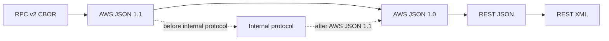
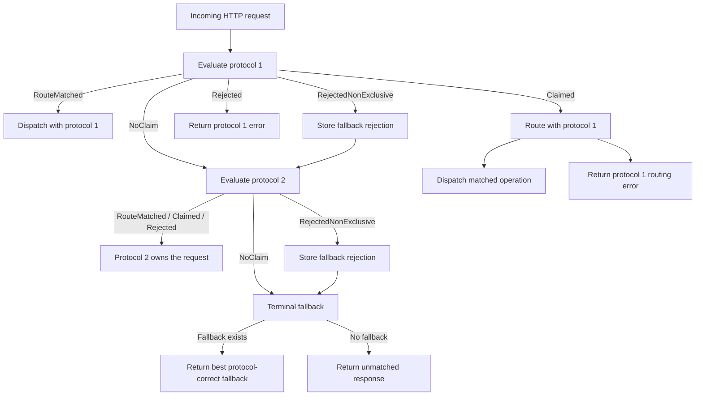
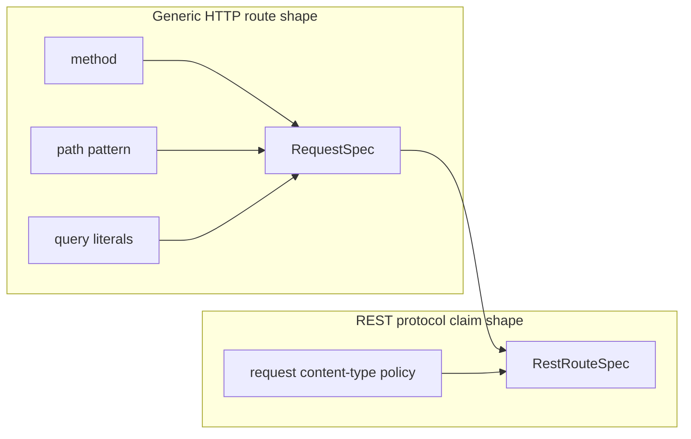
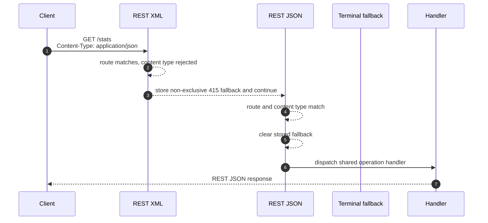
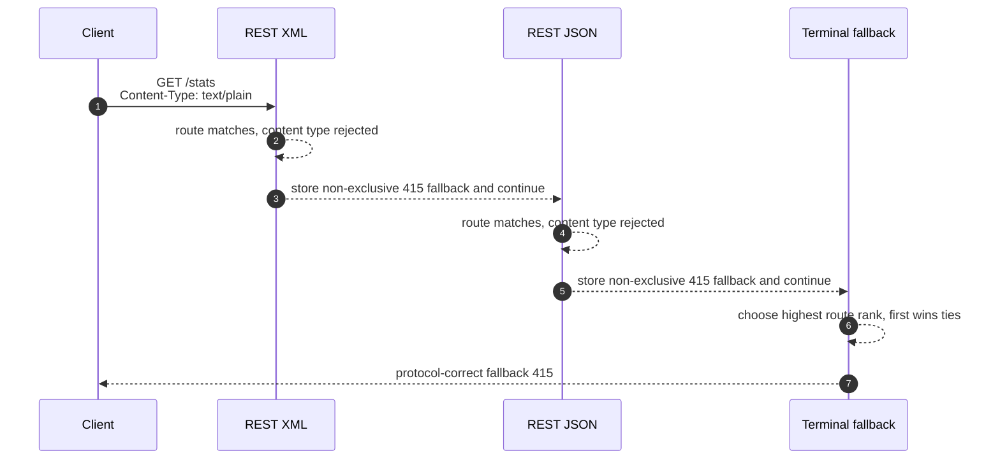
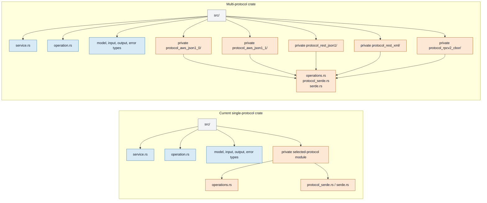

# Multi-protocol Rust server design

- **Status:** Draft
- **Audience:** smithy-rs server maintainers and contributors

## Executive summary

We want generated Rust servers to support every selected Smithy protocol for a
service while keeping one shared implementation of each operation. The generated
server should choose the protocol for each request, route to the shared handler,
and serialize the response using the selected protocol.

The recommended design is:

- generate one server crate with shared operation handlers and private
  protocol-specific modules;
- have each protocol report a protocol claim result for each request;
- make REST route claiming use operation-specific request `Content-Type`
  metadata;
- allow REST protocols to reject non-exclusively when another protocol may still
  claim the request; and
- if no later protocol claims, return the best stored protocol-correct fallback
  rejection.

## Problem

Today, a generated Rust server exposes a Smithy service through one selected
protocol. A Smithy model may list multiple protocols, but the generated server
does not serve all of them through one service implementation.

This creates two problems:

- services cannot accept multiple protocol wire formats through the same
  generated server; and
- adding a protocol would otherwise risk duplicating handler logic.

Once a protocol has been selected, the generated server can use that protocol's
existing parsing and serialization behavior. The new design work is deciding
which protocol owns an HTTP request when more than one protocol could plausibly
match it.

## Goals

- Serve all selected protocols from one generated Rust server.
- Preserve one shared handler implementation per operation.
- Preserve each protocol's request parsing, response serialization, modeled
  errors, validation, and event-stream behavior.
- Make ambiguous ownership deterministic.
- Keep single-protocol generated output unchanged.
- Keep protocol-specific generated code out of the public service API.

## Non-goals

This document does not describe low-level codegen plumbing, helper placement, or
decorator ordering internals.

This document assumes protocol ordering is deterministic, but does not specify
how the ordering is resolved.

This document does not solve every future compatibility case for ambiguous REST
requests. In particular, it leaves ambiguous-but-serviceable REST requests as
future work.

## Working example

The current example is:

```text
examples/pokemon-service-multi-protocol-server-sdk
```

It demonstrates the generated package shape: shared model and operation code,
with private modules for each selected protocol:

```text
protocol_aws_json1_0/
protocol_aws_json1_1/
protocol_rest_json1/
protocol_rest_xml/
protocol_rpcv2_cbor/
```

The client usage example exercises one client per protocol against the same
server:

```text
examples/pokemon-service-client-usage/examples/multi-protocol-clients.rs
```

This example should remain the main runnable proof point for the design.

## Background: protocol ownership

Some protocols can identify themselves from headers before operation routing.
For example:

- AWS JSON uses protocol content type plus `X-Amz-Target`;
- RPC v2 CBOR uses a protocol-identifying header.

When those headers identify a protocol, the request belongs to that protocol. If
the operation is unknown or the method is wrong, the server should return that
protocol's error format rather than trying a later protocol.

REST protocols are different. REST operation identity comes from HTTP method,
URI path, and query bindings. REST XML and REST JSON may both generate routes
such as:

```text
GET /stats
GET /pokemon-species/{name}
GET /radio
```

Therefore REST ownership needs more than route matching. It also needs the
operation's request content-type rule.

For REST XML, Smithy says protocol claiming uses:

- matching HTTP method and URI; and
- request `Content-Type` matching the operation input's derived content type,
  defaulting to `application/xml` unless the model derives or allows something
  else.

The same design applies to REST JSON with its own derived request content type.

## Protocol ordering

Selected protocols are evaluated in a deterministic order. Built-in protocols
and internal protocol extensions can participate in that order by declaring
relative ordering constraints, such as "before protocol X" or "after protocol
Y".

Codegen resolves those constraints into one protocol order before generating the
server. Conceptually, the protocols and their before/after constraints form a
graph:



The resolved order is what the runtime uses for request ownership. If a request
is ambiguous and more than one protocol could participate, the earlier protocol
gets the first chance to claim or reject. If ordering constraints are invalid,
for example because they form a cycle, generation should fail instead of
producing an unstable order.

The generated server uses this resolved order to build its protocol routing
layer stack. The stack ends in a terminal fallback service that returns the best
stored non-exclusive rejection when one exists, or the default unmatched
response otherwise.

## Design decisions

| Question | Decision |
| --- | --- |
| Generated package shape | One Cargo package with private protocol modules. |
| Handler model | One handler implementation per modeled operation, shared by all selected protocols. |
| Protocol ownership model | Each protocol reports a claim result; the outer server dispatches, rejects, or tries the next protocol. |
| REST claiming rule | REST route match plus operation-specific request `Content-Type` rule. |
| REST wrong/missing content type | Non-exclusive rejection, so later protocols can still claim. |
| REST wrong method | Non-exclusive rejection, for the same reason. |
| Terminal fallback | If no protocol claims, return the best stored fallback rejection; otherwise return the default unmatched response. |
| Fallback ranking | Highest existing REST route rank wins; first recorded wins ties. |
| Event streams | Use `application/vnd.amazon.eventstream` as the top-level request `Content-Type`. |
| Single-protocol behavior | Keep existing single-protocol layout and behavior. |

## High-level flow

Each protocol evaluates the request and reports what it knows. The outer server
decides what to do with that claim result.



Protocol ownership is terminal only when the claim is exclusive. A
non-exclusive rejection means the protocol rejected the request according to its
own rules, but that rejection does not prove that no later protocol can handle
the same HTTP request.

## Protocol claim vocabulary

The protocol claim result has five states:

| Claim | Meaning |
| --- | --- |
| `NoClaim` | This protocol has no claim on the request. |
| `RouteMatched` | This protocol owns the request and has already resolved the operation route. |
| `Claimed` | This protocol owns the request, but operation routing still needs to run. |
| `Rejected` | This protocol rejects the request and no later protocol should be tried. |
| `RejectedNonExclusive` | This protocol rejects the request, but a later protocol may still claim it. |

Examples:

| Request observation | Claim |
| --- | --- |
| RPC v2 CBOR protocol header is present | `Claimed` |
| AWS JSON headers identify JSON 1.1, but operation is unknown | `Claimed`, then protocol-specific unknown operation error |
| REST XML route matches with `Content-Type: application/xml` | `RouteMatched` |
| REST XML route matches with `Content-Type: application/json` | `RejectedNonExclusive` |
| REST XML path/query match but method is wrong | `RejectedNonExclusive` |

## REST route claiming

REST claiming separates generic route shape from REST-specific protocol
metadata.



`RequestSpec` remains the generic method/path/query route shape. `RestRouteSpec`
wraps it with the operation's request content-type rule.

REST content-type policy has two cases:

| Policy | Meaning |
| --- | --- |
| `Expected(media_type)` | `Content-Type` must be present, syntactically valid, and match the expected media type essence. |
| `AnyValidContentType { default }` | `Content-Type` must be present and syntactically valid, but the model allows any content type through an `@httpHeader("Content-Type")` input binding. |

For `Expected`, comparison is based on media type essence. Type/subtype matching
is case-insensitive, and parameters do not affect the match.

### Content-type derivation

The REST route claim policy should be derived per operation from the Smithy
model using the same model facts as generated request deserialization.

| Model case | Claim policy |
| --- | --- |
| REST XML default | `Expected("application/xml")` |
| REST JSON default | `Expected("application/json")` |
| `@httpPayload` with `@mediaType("fahad/awsome")` | `Expected("fahad/awsome")` |
| request event stream | `Expected("application/vnd.amazon.eventstream")` |
| `@httpHeader("Content-Type")` input member | `AnyValidContentType { default: ... }` |

Event streams do not need a separate policy. The claim check only looks at the
top-level HTTP request `Content-Type`; it does not inspect event stream
messages.

### REST claim outcomes

For REST protocols:

```text
method/path/query miss
    -> NoClaim

path/query match, method wrong
    -> RejectedNonExclusive(MethodNotAllowed)

route match, Content-Type missing
    -> RejectedNonExclusive(UnsupportedMediaType)

route match, Content-Type invalid or wrong
    -> RejectedNonExclusive(UnsupportedMediaType)

route match, Content-Type valid for operation
    -> RouteMatched
```

Missing `Content-Type` is intentionally non-exclusive. With overlapping REST
routes, the server cannot know whether the request was meant for REST XML, REST
JSON, or a later protocol.

This is stricter than some current generated server behavior. Today, many REST
`GET` operations work without a request `Content-Type` because the selected
single-protocol server routes first and validates request content type later, if
there is a body to deserialize. Multi-protocol route claiming happens earlier:
before one REST protocol has been selected. For the first implementation, a
missing `Content-Type` on an otherwise matching REST route is treated as a
non-exclusive `UnsupportedMediaType` fallback rather than an immediate route
match.

## Fallback rejections

When a protocol returns `RejectedNonExclusive`, the outer server records a
private fallback rejection and tries the next protocol.

If a later protocol claims or rejects exclusively, the stored fallback
rejections are cleared. If no protocol claims, the terminal fallback chooses the
best stored rejection and returns the protocol-correct response.





Fallback ranking uses the same route specificity rank already used for REST
route matching:

1. highest route rank wins;
2. first recorded wins ties.

This keeps protocol order as the tie breaker.

Fallback rejections should map to existing protocol errors. For example:

- method mismatch maps to the protocol's existing REST router
  `MethodNotAllowed` response;
- missing, invalid, or unexpected `Content-Type` maps to the protocol's existing
  `UnsupportedMediaType` runtime error.

No new client-facing error model is introduced.

## Generated package shape

Multi-protocol generation keeps one generated Cargo package. Shared service
concepts are generated once:

- model types;
- input, output, and error types;
- operation traits and handler-facing APIs;
- service builder APIs;
- customer-provided operation handlers.

Protocol-specific artifacts live in private modules. Multi-protocol generation
keeps the same public/shared surface and adds one private protocol module per
selected protocol:



The public generated API remains centered on the modeled service. The protocol
modules are an internal organization detail.

Single-protocol generation keeps the existing layout.

## Compatibility and customer impact

Single-protocol services should not see public API or behavior changes.

Customers opting into multi-protocol generation may see different concrete
generated service types. That is acceptable for multi-protocol support. The
design should still keep new runtime and fallback internals private where
possible.

Existing handlers remain shared. Customers should not need one handler per
protocol.

For request-scoped middleware or handlers that need to know which protocol was
selected, the server records the selected protocol in request extensions after
protocol claiming. Service teams can use that extension to detect which protocol
handled the request without relying on route shape or wire headers.

## Risks and mitigations

| Risk | Mitigation |
| --- | --- |
| REST XML or REST JSON claims too early. | Require operation-specific request `Content-Type` for REST route claiming. |
| Ambiguous REST requests depend on protocol order. | Use deterministic protocol order and preserve order as the fallback tie breaker. |
| Fallback details leak into customer APIs. | Keep fallback state private and convert to existing protocol errors. |
| Detection and deserialization drift. | Derive route claim policy from the same Smithy model facts used by request deserialization. |
| Multi-protocol concrete service types change. | Treat this as part of opting into multi-protocol support; keep handler APIs stable. |

## Validation plan

Tests should prove:

- one generated service dispatches through multiple protocols;
- one operation handler implementation is shared across protocols;
- REST XML and REST JSON route claiming uses operation request `Content-Type`;
- wrong REST `Content-Type` allows a later protocol to claim;
- if no later protocol claims, the best protocol-correct fallback rejection is
  returned;
- REST method mismatch is a non-exclusive rejection;
- event stream routes use `application/vnd.amazon.eventstream` as the top-level
  request content type;
- request parsing, response serialization, modeled errors, validation, and
  event streams remain protocol-correct;
- protocol-specific generated artifacts remain private; and
- single-protocol generated output remains unchanged.

The Pokemon multi-protocol example should remain the runnable end-to-end
example with one client per selected protocol.

## Future work

Some REST requests may be serviceable but not exclusive. For example, a
payloadless REST operation with no `Content-Type` may be acceptable to a
single-protocol REST XML server, but ambiguous in a multi-protocol REST
XML/REST JSON server.

A future design can add a non-exclusive successful route match, conceptually:

```text
RouteMatchedNonExclusive
```

If no later protocol claims the request, the server could dispatch the best
stored route match instead of returning a fallback rejection.

That likely requires storing boxed route services because different protocols
can have different concrete service types. It is not required for the first
implementation.

## Open questions

### Protocol-specific Smithy model transformations

Should `smithy-build-template.json` allow protocol-specific model
transformations?

Multi-protocol generation may need to produce protocol-specific generated
artifacts from slightly different effective models. If we allow
protocol-specific transformations, we need to define how they interact with:

- shared model types and shared operation handlers;
- protocol-specific request/response serde;
- protocol selection and route claiming;
- protocol tests; and
- user expectations that one generated server represents one Smithy service.

This document does not require protocol-specific model transformations for the
first implementation, but the package layout leaves room for protocol-specific
generated modules if we decide to support them.

### Middleware errors and `IntoResponse<Protocol>`

Some internal services may use protocol-specific `IntoResponse<Protocol>`
implementations to convert middleware errors into responses. Multi-protocol
servers need a clear pattern for those cases because the selected protocol is a
per-request decision rather than a single crate-wide protocol.

The server records the selected protocol in request extensions, which gives
middleware a way to observe the protocol selected for the current request. We
still need to audit internal usage and decide whether additional helper APIs are
needed for middleware that wants to return protocol-correct errors.

### Metrics for protocol claiming

Metrics emission needs a separate follow-up. Internally, we need to evaluate
which Coral-specific metrics should be emitted for multi-protocol routing and
protocol claiming. Externally, we need to check which metrics can be emitted
cleanly from the generated server/runtime surface.

This is immediate follow-up work, but it is not required for the first design
decision in this document.

## Alternatives considered

### Long-term: schema-decoupled serialization

The long-term preferred direction is schema-decoupled serialization. In that
model, generated code publishes Smithy schemas for shapes and operations, and
protocol implementations use those schemas to serialize and deserialize requests
and responses. The protocol owns HTTP binding behavior and payload codecs; the
generated service does not need protocol-specific generated serde functions for
every shape.

This direction is described in the schema-decoupling design:

```text
https://quip-amazon.com/tm3mAv0PT7Fg/Serialization-and-Schema-Decoupling
```

The Rust runtime already has initial building blocks in:

```text
rust-runtime/aws-smithy-schema
```

This is the better long-term architecture because it reduces generated
protocol-specific serde duplication and makes protocol implementations more
reusable. It would also simplify the generated package shape over time: private
`protocol_*` modules may still exist for protocol-specific operation glue, but
the generated `protocol_serde` shape folders would no longer need to be emitted
or published as generated artifacts.

We are not using this as the first implementation path because it is not ready
to be the server multi-protocol foundation yet:

- PR 4721 has not landed.
- The schema-serde path still needs to be proven first for single-protocol
  generation before multi-protocol generation depends on it.
- There are known follow-up issues:
  - https://github.com/smithy-lang/smithy-rs/issues/4801
  - https://github.com/smithy-lang/smithy-rs/issues/4802

Most decisions in this document still carry forward to schema-decoupled
serialization. Protocol claiming, REST route ownership, non-exclusive fallback
rejections, package-level sharing of handlers, and deterministic protocol order
remain necessary. The main implementation detail that changes is where
protocol-specific serialization code comes from.

Because generated protocol serde modules are internal details and not public
customer APIs, moving from generated `protocol_serde` modules to
schema-decoupled protocol serde should be possible later without a user-facing
API change.

### One crate per protocol

One alternative is a generated workspace with a shared crate and one crate per
protocol. That gives stronger physical isolation between protocol
implementations.

The preferred design is one Cargo package with private protocol modules. It
preserves existing generated package expectations, documentation paths,
dependency management, and handler APIs.

### Put content-type metadata on RequestSpec

Another alternative is to add request content-type metadata directly to
`RequestSpec`.

The preferred design keeps `RequestSpec` generic and introduces REST-specific
route metadata around it. This keeps the generic HTTP route shape separate from
REST protocol claiming.

## Security and operational impact

This change does not add a new network surface beyond the protocols selected by
the Smithy model. It changes how the generated server chooses between those
protocols.

The security-relevant concern is protocol confusion. A request rejected by REST
XML should not be incorrectly interpreted as REST XML if a later protocol can
correctly claim it. The design prevents that by making REST content-type
rejections non-exclusive.

There is no new customer data storage. Fallback metadata is request-scoped and
private to the server call path.
