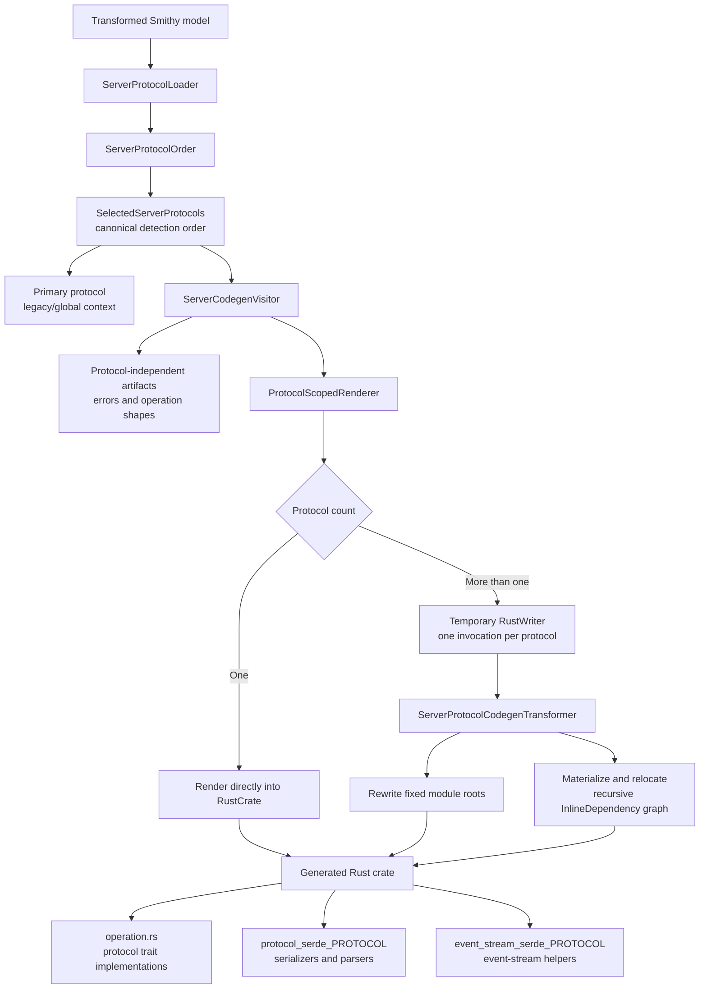
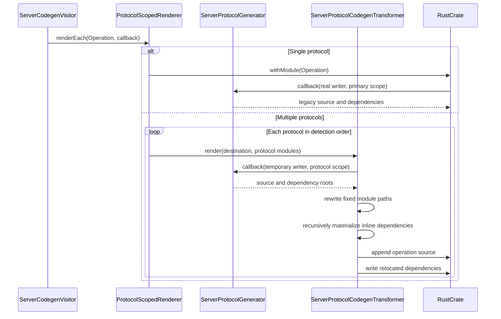
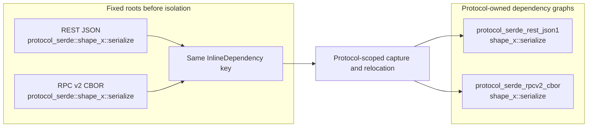

# Multi-protocol Server Code Generation

This document describes how server code generation emits protocol-dependent Rust code when a Smithy service supports
more than one protocol. It focuses on operation serialization and deserialization, including event-stream helpers and
lazy inline dependencies. Runtime request detection and routing are related concerns, but they are not the focus of this
document.

## Motivation

The shared protocol generators historically write generated functions into fixed Rust modules:

```text
crate::protocol_serde
crate::event_stream_serde
```

Function names are generally derived from Smithy shapes rather than protocols. Two protocols can therefore produce the
same dependency key for different implementations. For example, REST JSON and RPC v2 CBOR may both produce:

```text
crate::protocol_serde::shape_validation_exception::ser_validation_exception_error
```

An inline dependency is deduplicated using its module and name. If both protocols are rendered directly into one crate,
the second implementation can be discarded even though its body uses a different wire format. The generated crate may
still compile while one protocol silently uses another protocol's serializer.

Multi-protocol generation must isolate both the emitted operation source and every lazily discovered inline dependency.

## Goals

The architecture has the following goals:

- Preserve the existing generated structure for single-protocol services.
- Generate a distinct serializer, parser, and event-stream dependency graph for every selected protocol.
- Resolve protocol detection order once and reuse that order throughout code generation.
- Keep protocol orchestration out of `RustWriter`.
- Give generators a normal `RustWriter` so existing protocol generators do not need protocol-specific writer APIs.
- Keep the isolation implementation server-only.

It does not attempt to make arbitrary side effects inside a rendering callback protocol-scoped. Code must be emitted
through the writer supplied to the callback.

## Architecture



The important boundary is `ProtocolScopedRenderer`. Callers provide an ordered protocol collection, a destination Rust
module, and one rendering callback. The renderer owns protocol fan-out and decides whether the callback can write
directly or must be captured and isolated.

## Core types

### `SelectedServerProtocol`

`SelectedServerProtocol` contains all code-generation state for one selected protocol:

- The protocol factory.
- Its protocol-specific `ServerCodegenContext`.
- Its `ServerProtocolGenerator`.
- Its `ServerProtocolModules` destinations.
- The `ServerProtocol` implementation exposed by the generator.

Keeping these values together prevents callers from pairing a protocol generator with another protocol's context or
serde module.

### `SelectedServerProtocols`

`SelectedServerProtocols` is an ordered, non-empty collection. Its first entry is the primary protocol. The ordering is
the canonical runtime detection order resolved by `ServerProtocolOrder`.

The primary protocol is still used by code-generation paths that require one legacy/global context. Protocol-scoped
callbacks should instead use the protocol carried by their `ProtocolRenderScope`.

### `ServerProtocolModules`

`ServerProtocolModules` groups the two fixed module roots that must be isolated:

```kotlin
data class ServerProtocolModules(
    val serde: RustModule.LeafModule,
    val eventStreamSerde: RustModule.LeafModule,
)
```

For a single protocol, these resolve to the legacy modules. For multiple protocols, the protocol ID determines the
module suffix.

| Mode | Serde module | Event-stream module |
|---|---|---|
| Single protocol | `protocol_serde` | `event_stream_serde` |
| REST JSON in multi-protocol mode | `protocol_serde_rest_json1` | `event_stream_serde_rest_json1` |
| RPC v2 CBOR in multi-protocol mode | `protocol_serde_rpcv2_cbor` | `event_stream_serde_rpcv2_cbor` |

### `ProtocolScopedRenderer`

`ProtocolScopedRenderer<T>` owns the policy for rendering once per protocol. It is generic because protocol isolation
only requires an ordered collection and a function that returns each entry's `ServerProtocolModules`.

Its callback receives a `ProtocolRenderScope<T>` containing:

- The current protocol value.
- Its index in detection order.
- The total protocol count.
- Whether this is the primary invocation.

The operation generator currently uses `isPrimary` to emit shared supporting types exactly once. A future cleanup may
split shared generation from per-protocol generation and remove this transitional flag.

### `ServerProtocolCodegenTransformer`

`ServerProtocolCodegenTransformer` is the low-level capture and relocation mechanism. It is intentionally hidden behind
`ProtocolScopedRenderer`; callers should not calculate destination modules or invoke the transformer themselves.

## Per-operation generation

The visitor first renders protocol-independent operation artifacts. It then delegates protocol-dependent operation code
to one scoped callback:

```kotlin
protocolScopedRenderer.renderEach(ServerRustModule.Operation) { scope ->
    scope.protocol.generator.renderOperation(
        this,
        operationShape,
        generateSharedTypes = scope.isPrimary,
    )
}
```

The callback receiver is an ordinary `RustWriter`. Existing generators can continue using `rustTemplate`,
`RuntimeType`, and `RuntimeType.forInlineFun` without knowing which protocol-specific module will ultimately own the
result.



## Dependency relocation

Formatting a `RuntimeType` does not immediately render an inline function. Instead, the writer records an
`InlineDependency`, and crate finalization normally renders it later. Inline renderers can discover more inline
dependencies, so relocating only the first dependency is insufficient.

For multi-protocol generation, the transformer performs these steps:

1. Create a temporary writer using the destination module's definition file and namespace.
2. Invoke the protocol callback with that writer.
3. Define a root mapping:

   ```text
   crate::protocol_serde     -> crate::protocol_serde_PROTOCOL
   crate::event_stream_serde -> crate::event_stream_serde_PROTOCOL
   ```

4. Rewrite the captured operation source and append it to the real destination writer.
5. Traverse the captured dependencies using a queue.
6. For every inline dependency:
   - Remap its destination module, including child modules beneath a remapped root.
   - Render it into another temporary writer.
   - Discover dependencies declared by both the dependency and its renderer.
   - Rewrite its generated source.
   - Write the source into the remapped module in the real crate.
7. Transfer non-inline dependencies unchanged.
8. Deduplicate inline dependencies by their remapped destination module and name.



This relocation happens before the real crate can deduplicate the two protocol implementations under one fixed key.

## Generated crate layout

A service supporting REST JSON and RPC v2 CBOR produces a layout similar to:

```text
src/
├── operation.rs
├── protocol_serde_rest_json1/
│   └── shape_*.rs
├── protocol_serde_rpcv2_cbor/
│   └── shape_*.rs
├── event_stream_serde_rest_json1.rs
├── event_stream_serde_rpcv2_cbor.rs
└── service.rs
```

`operation.rs` contains the protocol-specific `FromRequest` and `IntoResponse` implementations. Those implementations
refer to the corresponding protocol-owned serde and event-stream modules.

## Invariants

The implementation relies on the following invariants:

1. At least one server protocol is selected.
2. `SelectedServerProtocols` remains in canonical detection order.
3. Single-protocol callbacks write directly to the real writer.
4. Multi-protocol callbacks emit source and dependencies only through the supplied writer.
5. Every fixed protocol-owned module root is included in the transformer's mapping.
6. Recursive inline dependencies are relocated before they reach normal crate-level deduplication.
7. Protocol-independent supporting types are emitted once.
8. Non-inline dependencies remain crate-wide and are transferred unchanged.

## Why this is not a `MultiProtocolRustWriter`

`RustWriter` is responsible for Rust syntax, imports, templates, and dependency recording. Protocol selection and
protocol ordering are higher-level code-generation policy. A specialized writer would mix these responsibilities and
would still be unable to infer whether a generated item is shared or protocol-dependent.

`RustWriter` is also a final class with a private constructor. Wrapping it would require duplicating its API and would
not be transparent to existing generators that require a real `RustWriter`.

The scoped renderer therefore uses composition:

- Existing generators receive a normal writer.
- `ProtocolScopedRenderer` owns protocol iteration.
- `ServerProtocolCodegenTransformer` owns capture and relocation.
- `RustCrate` remains responsible for final generated files.

## Boundaries and limitations

### Writes outside the supplied writer

The scoped renderer can isolate source and dependencies recorded by its supplied writer. It cannot intercept a callback
that directly mutates another `RustCrate` module. Protocol-dependent callbacks must not perform such writes.

### Textual path rewriting

The current server-only implementation rewrites fully qualified fixed module paths in captured Rust source. This avoids
changes to shared client/server protocol infrastructure, but it means newly introduced fixed module roots must be added
to the mapping.

A possible future core primitive could remap `RuntimeType` paths and `InlineDependency` modules semantically before
formatting and deduplication. That would be more general, but it would affect shared code-generation infrastructure and
is not required by the current server implementation.

### Shared and protocol-specific output

Some operation generation currently emits a shared generic type and protocol-specific trait implementations in one
method. `ProtocolRenderScope.isPrimary` prevents duplicate shared output. A cleaner future API would have distinct
`renderSharedOperation` and `renderProtocolOperation` phases.

### Service routing layout

Serde isolation and generated service routing are separate concerns. `ServerServiceGenerator` uses the selected protocol
order to build request specifications, routes, and nested protocol services. It should not be folded into
`ProtocolScopedRenderer`, whose responsibility is generated-source and dependency isolation.

## Extending protocol-dependent generation

When adding another protocol-dependent generation step:

1. Reuse the canonical `SelectedServerProtocols` collection.
2. Use `ProtocolScopedRenderer.renderEach` rather than writing a new protocol loop when the generated code may reference
   fixed serde modules or inline dependencies.
3. Emit all scoped source and dependencies through the callback's writer.
4. Use `scope.protocol` rather than the visitor's primary `codegenContext`.
5. Use `scope.isPrimary` only for genuinely shared output.
6. Add any new fixed module root to `ServerProtocolModules` and the transformer mapping.
7. Test two protocols that generate the same inline dependency name with different bodies.
8. Verify that single-protocol generated module names remain unchanged.

## Validation strategy

The focused tests cover complementary properties:

- `ProtocolScopedRendererTest` generates colliding nested inline dependencies with different bodies and compiles both
  implementations in one Rust crate.
- `ProtocolSpecificModuleTest` checks legacy single-protocol modules, protocol-specific multi-protocol modules,
  event-stream helper isolation, generated service ordering, and runtime dispatch.
- `ServerProtocolOrderTest` checks canonical protocol ordering and constraints.

Compilation alone is not sufficient: a collision can compile while retaining the wrong protocol body. Tests must assert
that distinct implementations survive and behave differently.

## Relevant implementation files

```text
codegen-server/src/main/kotlin/software/amazon/smithy/rust/codegen/server/smithy/
├── ServerCodegenVisitor.kt
└── protocols/
    ├── ServerProtocolGeneration.kt
    ├── ServerProtocolCodegenTransformer.kt
    ├── ServerProtocolLoader.kt
    └── ServerProtocolOrder.kt

codegen-server/src/test/kotlin/software/amazon/smithy/rust/codegen/server/smithy/
├── ProtocolSpecificModuleTest.kt
└── protocols/
    ├── ProtocolScopedRendererTest.kt
    └── ServerProtocolOrderTest.kt
```
